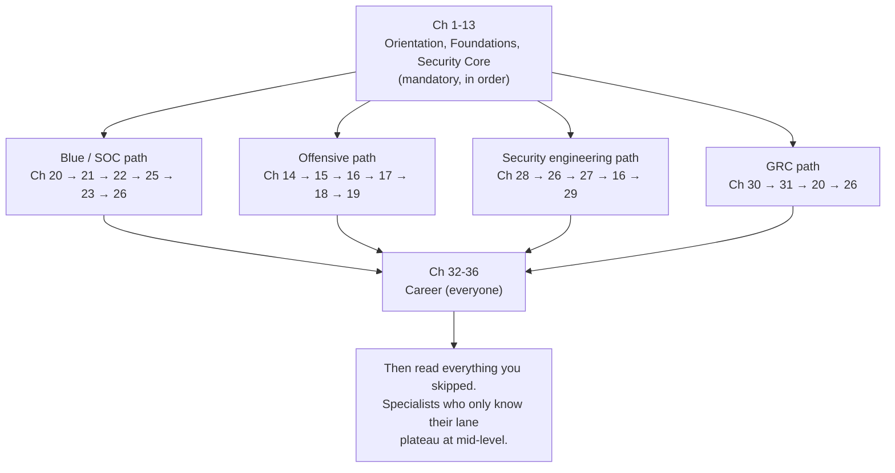

# The Cybersecurity Practitioner's Booklet

### From Computer Science Graduate to Security Professional — A Complete, Hands-On Course

**Version 1.0 · August 2026**

---

## What this is

This is a full self-study course, not a summary. It takes you from "I have a CS degree and I'm curious about security" to "I am a competent, employable security practitioner with a portfolio, a specialism, and a plan for mastery."

It is written on four assumptions:

1. **You can already program.** You know what a function, a pointer, a process, and a socket are. Chapters do not stop to explain a `for` loop, but they do stop to explain the parts of your CS degree that were taught theoretically and are used differently in security (memory layout, TCP state machines, filesystem metadata).
2. **You learn by doing.** Every chapter ends with labs you run in your own environment. Reading this booklet without doing the labs will produce the illusion of knowledge and nothing else.
3. **You want a job, then a career.** Technical chapters are paired with career chapters. Skill without evidence does not convert into employment.
4. **You will act legally and ethically.** [Chapter 3](part-0-orientation/03-ethics-law-and-the-professional-line.md) is not optional reading, and it comes before any offensive technique.

**Prerequisite reading:** [Cybersecurity for CS Graduates — Foundations and Prerequisites](../00-cybersecurity-foundations-and-prerequisites.md). That document is the map; this booklet is the territory.

---

## How long this takes

| Pace | Hours/week | Time to finish | Suitable for |
|---|---|---|---|
| Intensive | 30–40 | 4–6 months | Between jobs, full-time study |
| **Standard (recommended)** | **12–15** | **12 months** | Working or studying alongside |
| Relaxed | 6–8 | 18–24 months | Full-time job + family |

The [52-week schedule in Appendix D](appendices/D-52-week-study-schedule.md) maps every chapter and lab onto a calendar at the standard pace.

---

## Table of contents

### Part 0 · Orientation
| Ch | Title | Core question |
|---|---|---|
| 1 | [How to Use This Booklet](part-0-orientation/01-how-to-use-this-booklet.md) | How do I actually study this so it sticks? |
| 2 | [What Cybersecurity Actually Is](part-0-orientation/02-what-cybersecurity-is.md) | Who attacks, why, and how is the industry organized? |
| 3 | [Ethics, Law, and the Professional Line](part-0-orientation/03-ethics-law-and-the-professional-line.md) | What am I allowed to do, and how do I stay on the right side of it? |

### Part 1 · Foundations
| Ch | Title | Core question |
|---|---|---|
| 4 | [Computing Fundamentals for Security](part-1-foundations/04-computing-fundamentals.md) | What is actually happening under my code? |
| 5 | [Linux for Security Practitioners](part-1-foundations/05-linux-for-security.md) | Can I operate and investigate a Linux system fluently? |
| 6 | [Windows Internals and Active Directory](part-1-foundations/06-windows-and-active-directory.md) | How does the enterprise actually authenticate and get compromised? |
| 7 | [Networking Deep Dive](part-1-foundations/07-networking-deep-dive.md) | Can I explain every packet on the wire? |
| 8 | [Scripting and Automation](part-1-foundations/08-scripting-and-automation.md) | Can I build my own tools instead of only running others'? |
| 9 | [Building Your Home Lab](part-1-foundations/09-building-your-home-lab.md) | Where do I practice safely and legally? |

### Part 2 · Security Core
| Ch | Title | Core question |
|---|---|---|
| 10 | [Security Principles and Threat Modeling](part-2-security-core/10-security-principles-and-threat-modeling.md) | How do I reason about what can go wrong, systematically? |
| 11 | [Applied Cryptography](part-2-security-core/11-applied-cryptography.md) | How do I use crypto correctly and spot misuse? |
| 12 | [Identity, Authentication, Authorization](part-2-security-core/12-identity-authentication-authorization.md) | How do systems know who you are and what you may do? |
| 13 | [Adversary Models and MITRE ATT&CK](part-2-security-core/13-adversary-models-and-mitre-attack.md) | How do professionals describe and track attacker behavior? |

### Part 3 · Offensive Security
| Ch | Title | Core question |
|---|---|---|
| 14 | [Reconnaissance and OSINT](part-3-offensive-security/14-reconnaissance-and-osint.md) | What can I learn about a target before touching it? |
| 15 | [Scanning, Enumeration, Vulnerability Assessment](part-3-offensive-security/15-scanning-enumeration-vulnerability-assessment.md) | How do I map an attack surface accurately? |
| 16 | [Web Application Hacking](part-3-offensive-security/16-web-application-hacking.md) | How do web apps break, and how do I prove it? |
| 17 | [Host and Network Exploitation](part-3-offensive-security/17-host-and-network-exploitation.md) | How do I get a shell and then become root/SYSTEM? |
| 18 | [Active Directory Attack Paths](part-3-offensive-security/18-active-directory-attack-paths.md) | How does one foothold become domain admin? |
| 19 | [Professional Penetration Testing and Reporting](part-3-offensive-security/19-professional-penetration-testing-and-reporting.md) | How is this done as a paid engagement? |

### Part 4 · Defensive Security
| Ch | Title | Core question |
|---|---|---|
| 20 | [Logging, Telemetry, and SIEM](part-4-defensive-security/20-logging-telemetry-and-siem.md) | Where does evidence come from, and how do I query it? |
| 21 | [Detection Engineering](part-4-defensive-security/21-detection-engineering.md) | How do I write detections that work in production? |
| 22 | [Incident Response](part-4-defensive-security/22-incident-response.md) | What do I do when it's real? |
| 23 | [Digital Forensics](part-4-defensive-security/23-digital-forensics.md) | How do I reconstruct what happened, defensibly? |
| 24 | [Malware Analysis and Reverse Engineering](part-4-defensive-security/24-malware-analysis-and-reverse-engineering.md) | What does this binary do? |
| 25 | [Threat Intelligence and Threat Hunting](part-4-defensive-security/25-threat-intelligence-and-hunting.md) | How do I find what the alerts missed? |

### Part 5 · Modern Platforms
| Ch | Title | Core question |
|---|---|---|
| 26 | [Cloud Security](part-5-modern-platforms/26-cloud-security.md) | How is security different when you don't own the hardware? |
| 27 | [Containers and Kubernetes Security](part-5-modern-platforms/27-containers-and-kubernetes-security.md) | How do I secure workloads that live for minutes? |
| 28 | [DevSecOps and Software Supply Chain](part-5-modern-platforms/28-devsecops-and-software-supply-chain.md) | How do I build security into the pipeline? |
| 29 | [AI and LLM Security](part-5-modern-platforms/29-ai-and-llm-security.md) | How do I secure and attack AI systems? |

### Part 6 · Governance, Risk, and Compliance
| Ch | Title | Core question |
|---|---|---|
| 30 | [GRC: Frameworks and Risk Management](part-6-governance-risk-compliance/30-grc-frameworks-and-risk-management.md) | How does security get funded, measured, and audited? |
| 31 | [Privacy, Regulation, and Data Protection](part-6-governance-risk-compliance/31-privacy-regulation-and-data-protection.md) | What does the law require of me and my employer? |

### Part 7 · Career
| Ch | Title | Core question |
|---|---|---|
| 32 | [Building Your Portfolio](part-7-career/32-building-your-portfolio.md) | How do I prove what I can do? |
| 33 | [Certification Strategy](part-7-career/33-certification-strategy.md) | Which exams, in what order, and how do I pass them? |
| 34 | [The Job Hunt](part-7-career/34-the-job-hunt.md) | How do I get interviews and convert them? |
| 35 | [Your First 90 Days](part-7-career/35-your-first-90-days.md) | How do I not get fired and start compounding? |
| 36 | [From Competent to Master](part-7-career/36-from-competent-to-master.md) | What does the next five years look like? |

### Appendices
| # | Title |
|---|---|
| A | [Command and Tool Cheat Sheets](appendices/A-command-and-tool-cheatsheets.md) |
| B | [Annotated Bibliography](appendices/B-annotated-bibliography.md) |
| C | [Glossary](appendices/C-glossary.md) |
| D | [52-Week Study Schedule](appendices/D-52-week-study-schedule.md) |
| E | [Self-Assessment Rubrics](appendices/E-self-assessment-rubrics.md) |
| F | [Lab Build Files](appendices/F-lab-build-files.md) |

---

## Reading paths

You do not have to read all 36 chapters in order — but you do have to read Parts 0–2 in order. They are load-bearing.

**Everyone: Chapters 1 → 13, in order.** No shortcuts. This is the foundation, and every later chapter assumes it.

Then choose:

**Recommended for a CS graduate:** the security engineering path, with the blue path as your second pass. Your coding ability is a genuine advantage in engineering and detection work, and it is largely wasted in pure GRC.

---

## Conventions used throughout

| Marker | Meaning |
|---|---|
| **Lab** | Hands-on exercise. Do it. Do not read past it. |
| `command` | Type this. Output shown below it is representative, not guaranteed identical. |
| > ⚠️ | Safety, legal, or destructive-action warning. Read every one. |
| > ✅ | A checkable milestone — you should be able to do this before moving on. |
| **Self-check** | Questions at chapter end, with answers. Attempt before reading the answers. |

Every chapter follows the same structure: why it matters → what you'll be able to do → the material with worked examples → common mistakes → labs → references → self-check → what's next.

---

## Ground rules

1. **Never test a system you do not own or have written permission to test.** Chapter 3 explains exactly what "permission" means. This rule has no exceptions and no gray area worth exploring.
2. **All offensive practice happens in your lab, on deliberately vulnerable targets, or on platforms that grant permission in their terms of service** (TryHackMe, Hack The Box, PortSwigger, VulnHub, picoCTF).
3. **Snapshot before you experiment.** You will break things. That's the point.
4. **Write down what you did.** Chapter 1 explains the note-taking system; Chapter 32 turns those notes into the portfolio that gets you hired.

---

## A note on currency

Security knowledge decays. This booklet was written in August 2026 and reflects the tooling, certification landscape, and threat picture at that time — including the OWASP Top 10 for LLM Applications 2026 edition and NIST CSF 2.0.

Concepts (how Kerberos works, why prompt injection is unsolvable at the model layer, what a TCP handshake looks like) will outlive this edition by decades. Prices, exam codes, tool flags, and vendor product names will not. When something here disagrees with the vendor's current documentation, the vendor is right.
