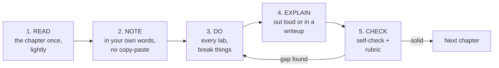

# Chapter 1 · How to Use This Booklet

> **Why this chapter matters:** Most people who set out to "learn cybersecurity" quit or plateau. Not because the material is too hard — because they study it the wrong way. This chapter is the difference between finishing and joining the pile of abandoned roadmaps. Read it once, properly.

> **By the end of this chapter you will:** have a note-taking system set up, understand the study loop this booklet is designed around, know how to run the labs safely, and have a weekly routine you can actually sustain.

---

## 1.1 The core problem: the illusion of knowledge

You read a chapter on SQL injection. It makes sense. You nod. You move on. Three weeks later, faced with a login form in a lab, you have no idea where to start.

This is the **illusion of knowledge**: recognizing an explanation feels identical to being able to produce the skill, but they are completely different capabilities. Recognition is cheap and fades in days. Production is expensive and lasts years. Employers pay for production.

Everything in this booklet's design fights the illusion of knowledge. The labs, the self-checks, the "explain it out loud" instructions, the writeups — none of them are decoration. They are the actual learning. The reading is just the setup.

> **The single most important sentence in this booklet:** *If you only read, you will learn almost nothing. The reading exists to make the doing possible.*

---

## 1.2 The study loop

Each chapter is built to be run as a five-step loop. Do not skip steps.



1. **Read** the chapter once, at normal speed. Do not highlight everything. Do not try to memorize. You are building a map, not the territory.
2. **Note** the key ideas *in your own words*. If you cannot restate it without looking, you did not understand it — that's useful information, go back.
3. **Do** every lab. This is 70% of the actual learning. Break things on purpose. Read the error messages. Fix them.
4. **Explain** what you did as if teaching someone one step behind you. Write it up (Chapter 32 turns these into your portfolio) or say it out loud. The gaps in your explanation are the gaps in your knowledge — this is the **Feynman technique**, and it is the fastest debugger for understanding that exists.
5. **Check** yourself against the self-check questions and the rubric in [Appendix E](../appendices/E-self-assessment-rubrics.md). If you can't hit the bar, loop back to step 3. Do not advance on hope.

A chapter is "done" when you can do the labs *without the instructions* and explain the why. Not when you've read the last line.

---

## 1.3 Spaced repetition and why cramming fails

Human memory follows a **forgetting curve**: without reinforcement, you lose the majority of new information within days. The fix is not to study harder in one sitting — it's to revisit material at expanding intervals (day 1, day 3, day 7, day 21). Each revisit is faster and pushes the memory further out.

Practically:

- Keep a running **flashcard deck** (Anki is the standard tool, free on desktop). Make a card whenever you learn a fact you'll need to recall cold — a port number, an Event ID, an ATT&CK technique, a `nmap` flag. Review 10–15 minutes daily. This one habit, sustained, outperforms any course.
- **Interleave.** Don't do five web-hacking labs back to back and then never touch web hacking again. Mix a networking lab, a Linux lab, and a web lab in a week. Interleaving feels harder and worse in the moment and produces dramatically better retention. Trust the discomfort.
- **Revisit old labs.** Every month, re-do one lab from two months ago, cold. If you can't, that skill has decayed and needs a refresh.

> ⚠️ **Cramming works for exams and fails for careers.** You can cram Security+ and pass. You cannot cram your way through a technical interview where someone hands you a shell and says "show me." Study for the interview, and the exam takes care of itself.

---

## 1.4 Your note-taking and knowledge system

Set this up *today*, before Chapter 2. You will produce hundreds of pages of notes over the next year, and a good system turns them into a portfolio; a bad one turns them into a mess you never open again.

**Recommended tool:** [Obsidian](https://obsidian.md) (free, local Markdown files, no lock-in). Notion also works. The requirement is: Markdown, searchable, links between notes, and it stays on your machine.

**Recommended folder structure** for your personal notes (separate from this booklet):

```
cyber-notes/
├── 00-inbox/              # quick captures, sort later
├── 01-concepts/          # one note per concept (kerberos.md, xss.md, cvss.md)
├── 02-tools/             # one note per tool (nmap.md, burp.md, wireshark.md)
├── 03-labs/              # one note per lab you complete — your raw writeups
├── 04-cheatsheets/       # your own, distilled from use
├── 05-writeups/          # polished, portfolio-ready versions of 03-labs
├── 06-flashcards/        # source material for Anki cards
└── 07-career/            # CV drafts, applications, interview notes
```

**Two rules that make notes valuable:**

1. **Write in your own words.** A copy-pasted command is worthless; a sentence explaining *when and why* you'd use it is gold. When you paste a command, add a line: "I used this to \_\_\_ and it worked because \_\_\_."
2. **Link concepts to each other.** In Obsidian, `[[kerberos]]` inside your `kerberoasting.md` note creates a link. Over months this builds a web that mirrors how security actually works — everything connects. When you can see that Kerberoasting links to Kerberos links to Active Directory links to service accounts links to password cracking, you understand the domain, not just the trick.

**Your lab writeup template** (save as a template you copy for every lab):

```markdown
# Lab: <name> — <date>

## Objective
What was I trying to do?

## Environment
Target(s), tools, versions.

## Steps taken
1. What I did, command by command, with output.
2. Where I got stuck and how I got unstuck.

## What actually happened (and why)
The mechanism. Not "it worked" — *why* it worked.

## Detection / defense angle
How would a defender see this? How would you prevent it?
(Fill this in even on offensive labs. It doubles the value.)

## References
Links, chapters, docs I used.

## What I'd do differently
```

That "detection/defense angle" line on every offensive lab is the highest-leverage habit in this entire booklet. It's what separates people who know a trick from people who understand the system, and interviewers can tell the difference in ninety seconds.

---

## 1.5 How the labs work and the safety contract

Every technical chapter ends with labs. They run in one of four safe places:

1. **Your own home lab** (built in [Chapter 9](../part-1-foundations/09-building-your-home-lab.md)) — isolated VMs you own.
2. **Deliberately vulnerable targets** you install yourself (DVWA, Juice Shop, Metasploitable, VulnHub images).
3. **Permission-granting platforms** whose terms of service explicitly authorize you to attack their machines: TryHackMe, Hack The Box, PortSwigger Web Security Academy, picoCTF, CyberDefenders, LetsDefend.
4. **Cloud free-tier accounts you own**, with billing alerts set.

That's it. That is the entire legal universe of your practice. [Chapter 3](03-ethics-law-and-the-professional-line.md) explains why the boundary is exactly here and what happens when people cross it.

> ⚠️ **The safety contract — agree to this before any lab:**
> - I will only attack systems I own or am explicitly authorized to attack.
> - I will run malware and exploits **only inside isolated VMs** with snapshots and no bridged networking.
> - I will **snapshot before** every experiment so I can roll back.
> - I will keep my lab network separated from my home network and the internet.
> - I will never use a technique learned here against a real system without written permission.

If any lab in this booklet would require breaking that contract to complete, the lab is wrong — not the contract. There are none, but the principle stands for the rest of your career.

---

## 1.6 A sustainable weekly routine

The people who finish are not the most talented. They're the ones who showed up every week for a year. Design a routine you can actually keep on a bad week, not your best week.

**A standard-pace week (12–15 hours):**

| Day | Time | Activity |
|---|---|---|
| Mon | 30 min | Anki review + read half a chapter |
| Tue | 2 hr | Read rest of chapter + take notes |
| Wed | 30 min | Anki review |
| Thu | 2.5 hr | Labs |
| Fri | 30 min | Anki review |
| Sat | 3–4 hr | Labs + write up one lab properly (portfolio) |
| Sun | 2 hr | Finish writeup, self-check, plan next week; one CTF challenge or community reading |

Adjust the blocks, but keep three things sacred: **daily Anki** (even 10 minutes), **a big lab block on the weekend**, and **one polished writeup per week**. The writeup is not extra — it *is* your portfolio being built in real time.

**When you fall behind** (you will): don't try to catch up by skipping labs. Skip the *reading* depth if you must, but never skip the doing. A week where you only did one lab well beats a week where you read three chapters and did nothing.

---

## 1.7 Using AI as a study partner (carefully)

You will study alongside AI assistants — that's normal and useful in 2026. Use them well:

**Good uses:**
- "Explain why this `nmap` output shows the port as filtered, not closed." (Debugging your understanding.)
- "I think Kerberoasting works because of X. Where is my reasoning wrong?" (Testing your model — the Feynman technique with a partner.)
- "Give me three more lab scenarios like this one to practice." (Generating reps.)
- "Review my pentest report draft for clarity and structure." (Improving your output.)

**Traps to avoid:**
- **Letting the AI do the lab for you.** If it hands you the exact commands and you paste them, you learned nothing — that's the illusion of knowledge with extra steps. Struggle first, ask second.
- **Trusting output you can't verify.** AI confidently invents flags, Event IDs, CVE numbers, and API details. In security, a wrong detail can be a false negative that misses a breach or a false positive that cries wolf. Verify against primary sources — vendor docs, the actual tool's `--help`, the real logs.
- **Skipping the "why."** An answer that solves your problem without teaching you the mechanism has cost you the lesson. Always ask the follow-up: "Why does that work?"

The rule: **AI accelerates a learner and replaces a non-learner.** Make sure you're the first kind. The moment you notice you couldn't do the last three labs without it, stop and do the next one entirely on your own.

---

## 1.8 Tracking progress and staying motivated

- **Keep a learning log.** One line a day: what you did, what broke, what you learned. On the days you feel like you're going nowhere — and there will be many — scroll back three months. The distance is always shocking and always motivating.
- **Set milestone-based goals, not time-based ones.** "Get a shell on the first Metasploitable service" beats "study for 2 hours." Milestones give you a finish line; time gives you a treadmill.
- **Find one accountability structure.** A study buddy, a Discord community, a public blog where people expect your writeups, or even a `git commit` streak on your notes repo. Isolation is the most common cause of quitting.
- **Celebrate the first shell, the first detection, the first CTF flag, the first passed cert.** These are real. Mark them.

---

## Common mistakes this chapter is trying to prevent

- **Reading the whole booklet before doing any labs.** You'll retain almost none of it. Read a chapter, do its labs, then move on.
- **Perfectionist note-taking that becomes procrastination.** Notes are a tool, not the product. If you're spending more time formatting notes than doing labs, you've inverted the priorities.
- **Waiting for the "perfect setup"** — the right laptop, the right course, the right moment. Start with what you have. [Chapter 9](../part-1-foundations/09-building-your-home-lab.md) shows how to lab on a 16 GB machine or entirely in a browser.
- **Studying in isolation with no output.** Invisible learning doesn't get hired and rarely gets finished.

---

## Labs

> **Lab 1.1 — Set up your knowledge system.** Install Obsidian (or Notion). Create the folder structure from §1.4. Create the lab writeup template as a reusable template. Write your first note: a note titled `why-i-am-learning-security` in your own words. You'll reread it on hard weeks.

> **Lab 1.2 — Set up spaced repetition.** Install Anki (free desktop version). Create a deck called "Security." Add your first five cards from anything you already know or from Chapter 2. Commit to reviewing daily.

> **Lab 1.3 — Sign the safety contract.** Copy the safety contract from §1.5 into a note. Add today's date. This sounds trivial. It is the most important thing you'll do this week — it's the habit that keeps your career legal.

> **Lab 1.4 — Design your week.** Copy the weekly routine table from §1.6 into your notes and edit it to fit your real life — job, family, energy levels. Be honest about a bad week, not optimistic about a good one.

---

## References and further reading

- **Barbara Oakley — *A Mind for Numbers*** (and her free Coursera course *Learning How to Learn*). The best practical guide to how technical learning actually works — spaced repetition, chunking, the focused/diffuse modes. Read/watch this in your first month; it pays for itself many times over.
- **Peter Brown, Henry Roediger, Mark McDaniel — *Make It Stick: The Science of Successful Learning*.** The research behind why testing and interleaving beat re-reading. Short and evidence-based.
- **Cal Newport — *Deep Work*.** On protecting the concentrated blocks this booklet requires.
- **Andy Hunt — *Pragmatic Thinking and Learning*.** Written for programmers moving to a new domain — which is exactly you.
- The Feynman technique — search for Richard Feynman's approach to learning; the one-page version is: explain it simply, find the gap, go back to the source, simplify again.

---

## Self-check

Attempt these before reading the answers.

1. What is the "illusion of knowledge" and which steps of the study loop are designed to break it?
2. Why does the booklet insist on a defense/detection note on *offensive* labs?
3. Your friend says "I read three chapters this week, I'm making great progress." What's the flaw in that measure?
4. Name the four — and only four — places you're allowed to practice offensive techniques.
5. What's the single daily habit that outperforms almost any paid course?

<details>
<summary>Answers</summary>

1. The illusion of knowledge is mistaking *recognizing* an explanation for being able to *produce* the skill. The **Do**, **Explain**, and **Check** steps break it by forcing production, not recognition.
2. Because it forces you to understand the *mechanism* rather than the trick, it teaches both sides of every attack, and interviewers can instantly tell the difference between someone who memorized a technique and someone who understands the system.
3. Reading measures input, not capability. Progress in security is measured by what you can *do* unaided — labs completed cold, not chapters read.
4. Your own home lab; deliberately vulnerable targets you install; permission-granting platforms (TryHackMe, HTB, PortSwigger, picoCTF, etc.); and cloud free-tier accounts you own.
5. Daily spaced-repetition review (Anki), 10–15 minutes.

</details>

---

## What's next

You have a system, a routine, and a safety contract. Now [Chapter 2](02-what-cybersecurity-is.md) gives you the map of the entire field — who the attackers are, how the industry is organized, and where you might fit — so that everything you learn afterward has a place to hang.
