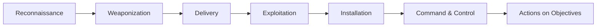

# Chapter 2 · What Cybersecurity Actually Is

> **Why this chapter matters:** You cannot navigate a field whose shape you can't see. This chapter is the map: what security is really about, who the attackers are and why, how the industry is organized into jobs, and where a CS graduate fits. Every later chapter is a zoomed-in view of some region of this map. Read it so the rest of the booklet has somewhere to land.

> **By the end of this chapter you will:** be able to explain the CIA triad with real examples, name the main categories of attacker and their motives, describe the major job families in the industry, and place your own goals on the map.

---

## 2.1 The one-sentence definition, unpacked

**Cybersecurity is the practice of protecting the confidentiality, integrity, and availability of information and systems against adversaries who are actively trying to defeat you.**

Three words in that sentence do the heavy lifting:

- **"Adversaries"** — This is what makes security different from reliability engineering or quality assurance. A bridge does not rethink its strategy when your inspection finds a weak bolt. An attacker does. Security is an *adversarial* discipline: there is a thinking opponent on the other side who adapts to your defenses. This is why there is no "done," no final secure state — only a moving contest.
- **"Actively trying to defeat you"** — Your defenses will be tested by someone whose job or motive is to get past them. A control that works against an accident may fail instantly against intent.
- **"Confidentiality, integrity, availability"** — the three properties you're protecting. This is the CIA triad, and it's the first mental model every practitioner internalizes.

---

## 2.2 The CIA triad — the foundation model

Almost every security concept can be traced back to protecting one of these three properties. Learn to instinctively ask, for any system: *which of these am I protecting, and against what?*

### Confidentiality — keeping secrets secret
Information is disclosed only to those authorized to see it.

- **Real example:** A hospital's patient records must be readable by treating clinicians and no one else. Encryption at rest, access controls, and audit logging all serve confidentiality.
- **Violated by:** a database breach, an eavesdropped connection, an over-shared cloud bucket, a shoulder-surfer, a misconfigured permission.
- **Protected by:** encryption, access control, authentication, data classification, need-to-know.

### Integrity — keeping data true
Information is not altered by unauthorized parties, and unauthorized changes are detectable.

- **Real example:** A bank balance must reflect only legitimate transactions. If an attacker can silently change "$100" to "$100,000," confidentiality is intact (they didn't *read* anything secret) but integrity is destroyed.
- **Violated by:** tampering, a corrupted software update, a man-in-the-middle rewriting traffic, ransomware encrypting files, SQL injection modifying records.
- **Protected by:** hashing, digital signatures, checksums, access control, version control, write-once logging.

### Availability — keeping systems usable
Information and systems are accessible to authorized users when needed.

- **Real example:** An e-commerce site during a sale must stay up. If it's knocked offline, no data was stolen or altered, but the business still loses money and trust.
- **Violated by:** denial-of-service (DoS/DDoS) attacks, ransomware, hardware failure, a fat-fingered config, resource exhaustion.
- **Protected by:** redundancy, backups, rate limiting, DDoS protection, capacity planning, disaster recovery.

> **The tension:** these three pull against each other. The most *confidential* system is one nobody can access — which destroys availability. The most *available* system is wide open — which destroys confidentiality. Security is the art of balancing the triad for a specific context. A public marketing site prioritizes availability; a nuclear launch system prioritizes integrity and confidentiality over convenient availability. There is no universally "secure" — only "secure enough for this purpose against this threat."

### Beyond the triad
Two more properties matter enough to name:

- **Authentication** — verifying *who* someone is.
- **Non-repudiation** — ensuring someone cannot deny having done something (e.g., a digitally signed transaction they can't later disown).

Together with the triad, and with **authorization** (what an authenticated party is allowed to do) and **accounting/auditing** (recording what they did), these form the vocabulary you'll use for the rest of your career. [Chapter 10](../part-2-security-core/10-security-principles-and-threat-modeling.md) builds the full principle set on top of this.

---

## 2.3 Who the attackers are and why (threat actors)

You cannot defend against an enemy you can't picture. Attackers are not a monolith; they differ enormously in skill, resources, patience, and motive — and those differences determine what defenses make sense. This is the beginning of **threat modeling**: your defenses should match the threats you actually face, not an abstract "hacker."

| Actor | Motive | Resources | Typical targets | What they teach you |
|---|---|---|---|---|
| **Script kiddies** | Ego, curiosity, boredom | Low — run others' tools | Whatever's easy and exposed | Basic hygiene stops most of them. Patch, don't expose, use strong passwords. |
| **Hacktivists** | Ideology, protest | Low–medium | Organizations they oppose | Public-facing systems and reputation matter. |
| **Cybercriminals / ransomware crews** | Money | Medium–high, professionalized, "ransomware-as-a-service" | Anyone who'll pay — hospitals, cities, SMBs, enterprises | The dominant real-world threat for most orgs. Backups and phishing defense are survival tools. |
| **Insiders** | Money, revenge, negligence | Variable — but already *inside* | Their own employer | The hardest threat. Least privilege and monitoring, not perimeter walls. |
| **Nation-state / APT (Advanced Persistent Threat)** | Espionage, sabotage, geopolitics | Very high — funded teams, custom tooling, patience measured in years | Governments, critical infrastructure, defense, tech supply chains | Against a determined APT, prevention alone fails; you need detection and response. |
| **Nation-state adjacent / AI-augmented actors** | As above, but scaled by automation | Increasingly high | Broadening as AI lowers effort | 2026 reality: AI is lowering the skill floor for attackers and raising the volume. |

Two lessons from this table shape everything:

1. **Defense is threat-relative.** A small business defends against ransomware crews and phishing; it does not (and cannot) defend against a nation-state's full arsenal, and it shouldn't spend as if it could. Match spend to threat.
2. **Against sufficiently resourced attackers, prevention is not enough.** You *will* be breached eventually. The mature question isn't "how do we become unbreachable?" (impossible) but "how fast do we *detect and respond* when — not if — someone gets in?" This is why the blue-team disciplines in Part 4 exist and why "assume breach" is a design principle, not pessimism.

---

## 2.4 The shape of an attack

Attackers rarely "hack in" in one move. Real intrusions unfold in stages, and understanding the stages lets defenders interrupt the chain at any point. Two models describe this; you'll meet both again in depth in [Chapter 13](../part-2-security-core/13-adversary-models-and-mitre-attack.md).

**The Cyber Kill Chain** (Lockheed Martin) — a linear seven-stage model:

A worked example — a ransomware incident:
1. **Reconnaissance** — attacker finds employee emails on LinkedIn.
2. **Weaponization** — crafts a malicious Office document.
3. **Delivery** — emails it as a fake invoice (phishing).
4. **Exploitation** — an employee opens it; a macro runs.
5. **Installation** — malware installs, establishes persistence.
6. **Command & Control** — the malware phones home to the attacker's server.
7. **Actions on Objectives** — attacker spreads laterally, steals data, then detonates ransomware.

**The insight:** the defender doesn't have to be perfect. They have to break the chain *once*. Block the phishing email (delivery), disable macros (exploitation), detect the C2 traffic (command & control), or spot the lateral movement (actions) — any one of these stops the attack. This is **defense in depth**: multiple independent chances to catch the same intrusion.

**MITRE ATT&CK** is the modern, far more detailed evolution of this idea — a giant, community-maintained matrix of real attacker **tactics** (the *why* of a step) and **techniques** (the *how*), observed in actual intrusions. It has become the shared language of the entire industry: red teams describe what they did in ATT&CK terms, blue teams describe what they detect in ATT&CK terms, and threat intel describes what adversaries do in ATT&CK terms. You'll learn to read and use it in Chapter 13. Bookmark it now: **attack.mitre.org**.

---

## 2.5 How the industry is organized: red, blue, purple

Security work is often described by color:

- **Red team — offense.** Simulates attackers to find weaknesses before real ones do. Penetration testers, red teamers, bug bounty hunters, exploit developers. Deliverable: proof of what could be broken, and how to fix it.
- **Blue team — defense.** Builds and operates the defenses, monitors for attacks, and responds when they happen. SOC analysts, detection engineers, incident responders, forensics, threat hunters. Deliverable: attacks stopped, or caught and contained fast.
- **Purple team — the collaboration.** Not a separate department so much as a *practice*: red and blue working together so that every attack red finds becomes a detection blue builds. The best organizations blur the line entirely.

A common myth is that offense is the "real" or "elite" security work. It isn't. Blue team has **far more jobs**, is where most beginners actually get hired, and — because you cannot defend what you don't understand — teaches you offense along the way. The reverse is also true: the best red teamers understand defense deeply. Do not silo yourself early. The strongest practitioners are **purple**: they can think from both chairs.

---

## 2.6 The job families (where you might actually work)

The field is wide. Here are the major job families, roughly grouped, with what the day-to-day actually looks like. Salary and demand notes reflect the 2026 market for context, not promises.

**Defensive operations (highest volume of entry-level roles)**
- **SOC Analyst (Tier 1/2/3)** — monitor alerts, triage, investigate, escalate. The most common on-ramp. You live in a SIEM and an EDR console.
- **Detection Engineer** — write and tune the rules that generate those alerts. More coding, less alarm-watching. A natural CS-grad fit.
- **Incident Responder** — when something's real, you contain and eradicate it. High-stakes, high-adrenaline.
- **Digital Forensics / DFIR Analyst** — reconstruct what happened from disk, memory, and logs. Detail-obsessed work.
- **Threat Hunter** — proactively look for attackers the alerts missed. Requires strong offensive knowledge.
- **Threat Intelligence Analyst** — track adversaries, their tooling and campaigns; inform the defenders.

**Offensive operations (fewer junior roles, higher bar)**
- **Penetration Tester** — authorized, scoped attacks against clients' systems; write reports. Consultancy-heavy.
- **Red Teamer** — longer, stealthier, objective-based adversary simulation. Usually a senior role.
- **Application Security Engineer (AppSec)** — find and fix vulnerabilities in software; work closely with developers. Strong CS-grad fit.
- **Bug Bounty Hunter** — freelance vulnerability finding for paid programs. Can supplement income and build reputation while learning.

**Engineering and platform (strongest natural fit for a CS graduate)**
- **Security Engineer** — build the guardrails, tooling, and secure infrastructure. Heavy coding.
- **DevSecOps Engineer** — bake security into CI/CD pipelines; automate everything.
- **Cloud Security Engineer** — secure AWS/Azure/GCP environments. Top-demanded skill in 2026; usually wants 1–2 years' experience first.
- **AI Security Engineer** — secure LLM and agentic applications, red-team models. Top-demanded and scarce in 2026 — your differentiator.

**Governance and management (writing- and people-heavy, hires beginners readily on the GRC side)**
- **GRC / Risk / Compliance Analyst** — frameworks, audits, risk registers, policy. Less technical, real on-ramp.
- **Security Architect** — design secure systems at scale. Senior.
- **CISO and security management** — lead the program, own the risk, answer to the board. Years away, but know it exists.

> **The map's key insight for you:** as a CS graduate, your comparative advantage is *code*. That points you at **security engineering, detection engineering, AppSec, and AI security** — roles where the ability to build, not just operate, sets you apart. You can absolutely enter through a SOC role (many do, and it's excellent grounding), but don't let anyone tell you GRC is your only door because you're "new." Your degree is worth more in the engineering lanes.

---

## 2.7 A day in three lives (so the roles feel real)

**A SOC Analyst's Tuesday:** Log in, check the alert queue. An EDR alert fires: PowerShell spawned from a Word document on a finance user's laptop. You pull the process tree, check the command line (base64-encoded — suspicious), look up whether the finance user opened an attachment, correlate against the email gateway logs, decide it's a real phishing payload, isolate the laptop, and escalate to Tier 2 with a written timeline. Then back to the queue. You'll do this dozens of times a day; most alerts are noise, and knowing which few aren't is the whole skill.

**A Penetration Tester's Tuesday:** You're three days into a two-week engagement against a client's web application, under a signed contract with a defined scope. You've mapped the app in Burp Suite, found that changing an `account_id` in a request shows you *other users'* invoices (an IDOR — broken access control), and you're now documenting it with reproduction steps, impact, and a screenshot. This afternoon you'll test the API for the same class of bug. Friday you start writing the report — which is the actual product the client pays for.

**A Security Engineer's Tuesday:** A developer's pull request adds a new dependency. Your automated pipeline flagged it as having a known vulnerability, and you're deciding whether it's exploitable in this context or a false positive worth suppressing. Later you'll write a policy-as-code rule that blocks any future PR from hardcoding cloud credentials, because someone did that last week. Your job is to make the secure path the easy path so 200 developers don't each have to be a security expert.

---

## 2.8 Common misconceptions to drop now

- **"Cybersecurity is all hacking."** Offense is a minority of the field. Most security work is defense, engineering, and governance.
- **"You need to be a genius / math prodigy."** You need persistence and systematic thinking far more than raw brilliance. The people who succeed are the ones who don't quit when the box doesn't fall in an hour.
- **"There's a shortage, so I'll get hired easily."** The shortage is real *and* junior hiring is narrow. Both are true. Read [Chapter 34](../part-7-career/34-the-job-hunt.md) with clear eyes.
- **"Certs alone will get me a job."** Certs get you past the résumé filter. A portfolio and the ability to demonstrate skill get you the offer.
- **"Once it's secure, it's done."** Security is a continuous adversarial process. There is no finished state — only maintained states and stale ones.
- **"Attackers are all criminal geniuses."** Most successful attacks use known techniques against unpatched, misconfigured, or phishable targets. The boring fundamentals stop the majority of real attacks.

---

## Labs

> **Lab 2.1 — CIA in the wild.** Pick three systems you use daily (e.g. your bank app, your email, a game). For each, write which leg of the CIA triad matters *most* and why, and name one realistic way each could be violated. Save it in your notes. This trains the instinct you'll use forever.

> **Lab 2.2 — Read a real breach.** Find a well-documented breach writeup (search for a post-incident report, or read one from a security vendor's blog). Map it onto the Cyber Kill Chain: identify each stage. Then identify one point where a single defense would have broken the chain. Write it up.

> **Lab 2.3 — Explore ATT&CK.** Go to attack.mitre.org. Pick one technique (e.g. T1566 Phishing). Read it. Note: what tactic does it serve, what real groups use it, and what detections/mitigations MITRE lists. You're not memorizing — you're learning the tool's shape. You'll return to it in Chapter 13.

> **Lab 2.4 — Place yourself on the map.** Reread §2.6. Write down the two or three job families that appeal to you most and why, and the two that appeal least. This isn't a commitment — it's a hypothesis you'll test as you go through the booklet. Revisit it after Part 4.

---

## References and further reading

- **Andrew Jaquith / general — start with the *CIA triad* and *threat actor* entries in [Appendix C Glossary](../appendices/C-glossary.md)** and expand from there.
- **MITRE ATT&CK** — [attack.mitre.org](https://attack.mitre.org). The single most important free resource in the field. Just browse it this week.
- **Lockheed Martin Cyber Kill Chain** — the original whitepaper is a short, worthwhile read; search "Lockheed Martin Cyber Kill Chain."
- **Verizon Data Breach Investigations Report (DBIR)** — published annually, free. The best data-driven picture of how breaches *actually* happen (spoiler: phishing, stolen credentials, and unpatched systems dominate). Read the executive summary of the latest edition.
- **The Cuckoo's Egg — Cliff Stoll.** A true story of tracking a hacker through a lab's systems in the 1980s. Reads like a thriller, teaches the mindset better than any textbook, and is the book most working professionals name as their gateway. Read it for enjoyment early on.
- **Ross Anderson — *Security Engineering* (3rd edition, chapters 1–2 for now; the whole book later).** The definitive text on how security systems really work and fail. The full PDF is freely available from the author's site. Dense; return to it repeatedly across your career.
- **CISA (cisa.gov)** and your national cybersecurity agency — for how governments frame the threat landscape.

---

## Self-check

1. Give a real-world example where confidentiality is intact but integrity is destroyed.
2. Why is "adversary" the word that makes security different from ordinary reliability engineering?
3. Why does the defender only need to break the kill chain *once*, and what security principle does that illustrate?
4. Against a well-resourced nation-state attacker, why is prevention alone considered insufficient, and what does that imply about where to invest?
5. As a CS graduate, which job families give you the strongest comparative advantage, and why?

Answers

1. An attacker who silently alters a bank balance or a medical record without reading anything secret — the data is unchanged in secrecy (confidentiality intact) but is now false (integrity destroyed). SQL injection that modifies rows is a classic case.
2. Because there is a thinking, adapting opponent actively trying to defeat your controls. A control that survives accidents can fail instantly against intent, and the opponent changes strategy in response to your defenses — so there's no static "solved" state.
3. Because a real attack is a chain of dependent stages; interrupting any single stage stops the whole attack. This illustrates **defense in depth** — multiple independent chances to catch the same intrusion.
4. Because a sufficiently resourced, patient adversary will eventually find a way through any preventive control (a new exploit, a phishable person, a supply-chain path). So you must invest in **detection and response** — "assume breach" — to catch and contain intrusions quickly, not only in walls to keep everyone out.
5. Security engineering, detection engineering, AppSec, and AI security — because they reward the ability to *build and automate*, which is exactly what a CS degree develops, rather than only operating others' tools.

---

## What's next

You have the map. Before you learn a single offensive technique, you must understand the line between security work and crime — because they use identical tools and are separated only by authorization. [Chapter 3](03-ethics-law-and-the-professional-line.md) draws that line precisely. It is the most important chapter in Part 0.
