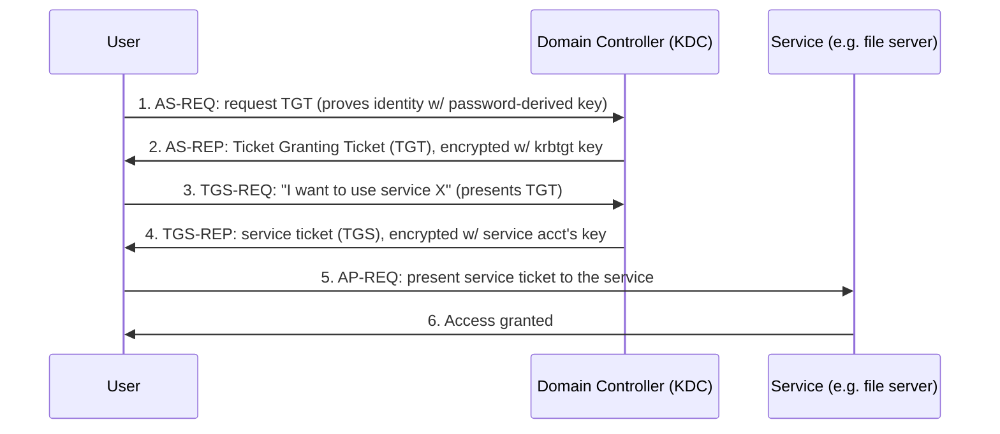

# Chapter 6 · Windows Internals and Active Directory

> **Why this chapter matters:** Most beginners love Linux and skip Windows. That's a mistake that will cap your career. The overwhelming majority of *enterprise* breaches happen inside Windows environments running **Active Directory (AD)** — the system that authenticates users across virtually every large organization. If you can't explain how AD authentication works and how it's abused, you can't work in enterprise defense *or* offense. This is the chapter that separates hobbyists from professionals.

> **By the end of this chapter you will:** understand Windows security architecture (accounts, tokens, the registry), explain Active Directory's structure, describe how Kerberos and NTLM authentication actually work, and recognize the core AD attack techniques (Kerberoasting, Pass-the-Hash, DCSync) at a conceptual level. You'll go hands-on with attacks in [Chapter 18](../part-3-offensive-security/18-active-directory-attack-paths.md); here you build the model.

---

## 6.1 Why Windows dominates enterprise attacks

Corporations run on Windows: employee laptops, file servers, email, and — centrally — **Active Directory**, which manages every user account, computer, and permission in the organization from a set of **Domain Controllers (DCs)**. Compromise the domain and you effectively own the company's IT. That's why attackers target AD relentlessly and why "domain admin" is the crown jewel of most enterprise intrusions.

Your job, red or blue, requires understanding this environment. A SOC analyst reads Windows event logs all day. A pentester's whole objective is often "get domain admin." Neither works without the model below.

---

## 6.2 Windows security architecture essentials

**Accounts and identifiers:**
- **Local accounts** live on a single machine; **domain accounts** live in AD and work across the domain.
- Every account has a **SID (Security Identifier)** — a unique string like `S-1-5-21-...-500`. The RID (last part) `500` = built-in Administrator, `512` = Domain Admins group. SIDs, not names, are what Windows actually checks.

**Access tokens** — when you log in, Windows creates an **access token** describing your identity and privileges; every process you run carries a copy. This is the Windows analog of Linux uid/privileges. **Token theft/impersonation** — stealing or duplicating a more-privileged process's token — is a core Windows privilege-escalation technique.

**Authentication internals — where the secrets live:**
- **LSASS (Local Security Authority Subsystem Service)** — the process that handles authentication and *holds credentials in memory* (hashes, sometimes tickets). Attackers dump LSASS memory (famously with **Mimikatz**) to steal credentials. Protecting LSASS (Credential Guard, LSASS protection) is a key defense. Remember this name — LSASS is the single most attacked process in Windows.
- **Password representations:** Windows stores/uses password **hashes**, notably the **NT hash** (an unsalted MD4 of the password). Because it's used directly in NTLM auth, you often don't even need to crack it — see Pass-the-Hash below.

**The Registry** — a hierarchical database of system and application configuration (`HKLM`, `HKCU` hives). Security-relevant because: it stores config that attackers modify for persistence (`Run` keys that launch programs at boot), it holds the **SAM** (local account hashes), and forensic analysts mine it for evidence. Learn the major hives and the common persistence keys.

**Other must-know subsystems:**
- **Services** — background programs (like Linux daemons/systemd); misconfigured service permissions are a privesc vector.
- **Scheduled Tasks** — Windows cron; a persistence spot.
- **WMI (Windows Management Instrumentation)** — a powerful management interface attackers use for recon, lateral movement, and stealthy persistence.
- **PowerShell** — the admin automation language and *the* attacker's post-exploitation tool of choice (which is why PowerShell logging is a critical defensive control).

---

## 6.3 Active Directory structure

AD is a directory service — a database of **objects** (users, computers, groups) plus the authentication and policy machinery around them.

```
Forest  (the top-level security boundary; one or more domains sharing schema/trust)
└── Domain  (e.g. corp.example.com — a unit of admin/authentication)
    ├── Domain Controllers (DCs)  ← the servers running AD; hold the whole database
    ├── Organizational Units (OUs)  ← containers for organizing objects + applying policy
    │   ├── Users (alice, bob, service accounts...)
    │   ├── Computers (laptops, servers...)
    │   └── Groups (Domain Admins, HR, Finance...)
    └── Group Policy Objects (GPOs)  ← centrally push settings/security config to objects
```

Key concepts:
- **Domain Controller (DC)** — holds the AD database (`NTDS.dit`, which contains *all* domain password hashes). Compromising a DC = compromising the domain. This is why "get to the DC" is the endgame.
- **Domain / Forest / Trusts** — a forest is the security boundary; domains within/between forests can **trust** each other, and trust relationships are themselves attack paths (crossing from a compromised domain into a trusting one).
- **OUs** organize objects and are where GPOs apply.
- **Groups** grant permissions collectively. **Domain Admins**, **Enterprise Admins**, and a few others are the high-value targets.
- **GPOs (Group Policy Objects)** push configuration and security settings across the domain — powerful for defense (enforce hardening everywhere) and a target for attack (edit a GPO, push malware everywhere).
- **LDAP** is the protocol used to query AD; **BloodHound** (Chapter 18) uses LDAP data to *map attack paths* from any user to Domain Admin graphically — one of the most important tools in modern AD security, used by both sides.

---

## 6.4 How authentication actually works: NTLM and Kerberos

This is the heart of the chapter. AD supports two authentication protocols. Understanding their mechanics is what makes the attacks make sense.

### NTLM (older, challenge-response)
1. Client wants to authenticate to a server.
2. Server sends a random **challenge**.
3. Client encrypts the challenge using its **NT hash** and returns the result.
4. Server (via the DC) verifies.

**The critical weakness:** the NT *hash* is the credential — the protocol proves you know the hash, not the plaintext password. So an attacker who **steals the hash never needs to crack it** — they can authenticate directly with it. This is **Pass-the-Hash (PtH)**: reuse a stolen NT hash to authenticate as that user across the network. It's one of the most impactful enterprise attack techniques ever, and it's *by design* in how NTLM works.

### Kerberos (default in AD, ticket-based)
Kerberos avoids sending secrets repeatedly by using time-limited **tickets** issued by the DC (which acts as the **Key Distribution Center, KDC**). Simplified flow:



- **TGT (Ticket Granting Ticket)** — your "master ticket," proving you authenticated. Encrypted with the secret key of the special **krbtgt** account.
- **TGS (service ticket)** — grants access to one specific service. Encrypted with that *service account's* key (derived from its password).

Now the attacks fall out of the design:

- **Kerberoasting** — *any* domain user can request a service ticket (TGS) for a service account, and that ticket is encrypted with the service account's password-derived key. The attacker takes it **offline and cracks it** to recover the service account's password. Service accounts often have weak, non-expiring passwords and high privileges → jackpot. (Chapter 18 does this hands-on.)
- **AS-REP Roasting** — for accounts with "Kerberos pre-authentication" disabled, an attacker can request material that's crackable offline without even needing valid credentials first.
- **Pass-the-Ticket** — steal a TGT/TGS from memory and reuse it (like PtH but with tickets).
- **Golden Ticket** — if an attacker steals the **krbtgt** account's key (from a compromised DC), they can *forge* TGTs for *any user with any privileges* — total, persistent domain compromise that survives password resets. The nuclear scenario.
- **DCSync** — an attacker with sufficient rights *asks a DC to replicate* password data (pretending to be another DC), extracting hashes for any account — including krbtgt — without touching the DC's disk. A stealthy path to the Golden Ticket.

> **The unifying insight:** these aren't exotic zero-days. They're **abuses of how AD authentication is designed to work** — the same tickets and hashes that make single-sign-on convenient are the currency attackers steal and reuse. That's why AD security is about *monitoring and hardening the legitimate mechanisms*, not patching a bug.

---

## 6.5 Windows logging: the defender's view

If you go blue, Windows Event Logs are your primary evidence. Learn the security-relevant Event IDs (you'll query these in Chapter 20):

| Event ID | Meaning | Why it matters |
|---|---|---|
| 4624 | Successful logon | Track access; note the **Logon Type** (2=interactive, 3=network, 10=RDP) |
| 4625 | Failed logon | Brute-force / password-spray detection |
| 4688 | Process creation | Detect malicious processes & command lines (enable command-line logging!) |
| 4672 | Special privileges assigned | Someone got admin-level rights |
| 4768 / 4769 | Kerberos TGT / service ticket requested | Kerberoasting and ticket anomalies |
| 4720 / 4728 / 4732 | Account created / added to privileged group | Persistence & privilege escalation |
| 7045 | New service installed | Common malware/persistence footprint |

**Sysmon (System Monitor)** — a free Microsoft Sysinternals tool that dramatically enriches Windows logging: full process trees with hashes, network connections, image loads, registry changes. Sysmon + a SIEM is the backbone of most Windows detection. You'll deploy it in Part 4. Install the name in your memory now.

---

## 6.6 The defensive picture (so offense has a counterpart)

For every attack above, there's a defense — this is your future blue-team work:
- **Tiered administration / no reuse of admin creds on workstations** — limits Pass-the-Hash and credential theft blast radius.
- **Strong, managed service-account passwords (gMSA)** — kills Kerberoasting.
- **LSASS protection / Credential Guard** — stops memory credential dumping.
- **Monitoring privileged group changes, DCSync-like replication from non-DCs, anomalous ticket requests** — catches the stealthy paths.
- **Least privilege, aggressive patching, and BloodHound-driven attack-path reduction** — shrinks what any single compromise can reach.

The single most important idea: in AD, **you assume an attacker will get *a* foothold, and you architect so that one foothold can't easily become domain admin.** That's attack-path management, and it's where AD offense and defense meet.

---

## Common mistakes

- **Skipping Windows/AD because Linux is more fun.** This is the most career-limiting mistake beginners make. Most enterprise money and jobs are in Windows environments.
- **Memorizing attack names without the mechanism.** "Kerberoasting" is meaningless until you can explain *why* any user can request that ticket and *why* it's crackable offline. Learn the flow, and the attacks become obvious.
- **Thinking AD attacks are exotic.** They're standard, and they exploit *designed behavior*. That's what makes them hard to "just patch."
- **Ignoring logging/Sysmon as "the boring part."** It's how the entire industry actually catches these attacks. Offense without knowing what's logged gets caught; defense without it is blind.

---

## Labs

> **Lab 6.1 — Explore Windows security.** On a Windows VM (a free evaluation VM — see Chapter 9), open Event Viewer and find logon events (4624/4625). Trigger a failed login and find its 4625. Note the Logon Type. Open Task Manager → Details and find `lsass.exe` — the process attackers target. Write up what each represents.

> **Lab 6.2 — Diagram Kerberos from memory.** Without looking, draw the Kerberos authentication flow (AS-REQ → TGT → TGS-REQ → service ticket → access). Then annotate *where* each of these attacks intervenes: Kerberoasting, Pass-the-Ticket, Golden Ticket. This diagram is a rite of passage; redo it until it's automatic.

> **Lab 6.3 — Build a mini AD lab (preview).** Following Chapter 9 / Appendix F, stand up a Windows Server VM as a Domain Controller and join one Windows client to the domain. Create a few users, a group, and a service account. You'll attack this exact lab in Chapter 18. For now, just get it running and explore Active Directory Users and Computers.

> **Lab 6.4 — Install Sysmon.** On your Windows VM, install Sysmon with a good community config (e.g., the widely used SwiftOnSecurity/Olaf config). Run a few programs and watch the rich events appear in Event Viewer under Microsoft/Windows/Sysmon. Compare the detail to default logging. This is what defenders actually work with.

> **Lab 6.5 — TryHackMe AD path.** Complete TryHackMe's introductory Active Directory rooms (search their "Active Directory Basics" and Kerberos content). Guided, safe, and they cement this chapter's concepts hands-on.

---

## References and further reading

- **Microsoft Learn — Active Directory & Windows Security documentation** ([learn.microsoft.com](https://learn.microsoft.com)). The authoritative source; dry but correct.
- **"Active Directory Security" — adsecurity.org (Sean Metcalf).** The best free deep-dive blog on AD attacks and defense. Read his Kerberos and DCSync articles after this chapter.
- **The Hacker Recipes — [thehacker.recipes](https://www.thehacker.recipes).** Excellent free, structured catalog of AD attacks with the mechanics explained.
- **TryHackMe / HackTheBox Academy AD paths** — the best guided hands-on introduction.
- **BloodHound documentation** — [bloodhound.specterops.io](https://bloodhound.specterops.io). Read the concepts even before you use the tool.
- **Sysmon + SwiftOnSecurity config** — search "Sysmon SwiftOnSecurity config" for the community-standard configuration.
- **"Microsoft Windows Internals" — Russinovich, Solomon, Ionescu.** The deep reference on how Windows actually works. Career-long; dip in as needed.

---

## Self-check

1. Why does compromising a Domain Controller equal compromising the whole domain?
2. Explain Pass-the-Hash. Why does NTLM's design make it possible *without* cracking the password?
3. In Kerberos, what is a TGT, what is a service ticket, and which one does Kerberoasting target and why is it crackable offline?
4. What is LSASS and why is it the most-attacked process on Windows?
5. Name three Windows Event IDs and what each tells a defender.

<details>
<summary>Answers</summary>

1. Because the DC holds the entire AD database (`NTDS.dit`) — every account's password hash, including **krbtgt** — and issues all authentication tickets. Control of a DC means you can authenticate as, or forge tickets for, anyone in the domain (Golden Ticket) and read every credential.
2. Pass-the-Hash reuses a stolen **NT hash** to authenticate as that user. NTLM proves knowledge of the *hash* (the client encrypts the server's challenge with the NT hash), not the plaintext password — so possessing the hash is functionally equivalent to knowing the password, no cracking required.
3. A **TGT** is the master ticket proving you authenticated (encrypted with the krbtgt key); a **service ticket (TGS)** grants access to one specific service (encrypted with that service account's password-derived key). Kerberoasting targets the **service ticket** because any user can request one and it's encrypted with the service account's key — so it can be taken **offline and cracked** to recover that account's (often weak) password.
4. LSASS is the Local Security Authority Subsystem Service — it handles authentication and **holds credentials (hashes/tickets) in memory**. Attackers dump its memory (e.g., Mimikatz) to harvest credentials for reuse and lateral movement, making it the prime target; defenses like Credential Guard exist specifically to protect it.
5. Any three: 4624 (successful logon), 4625 (failed logon — brute force/spray), 4688 (process creation — malicious processes/command lines), 4672 (special privileges assigned), 4768/4769 (Kerberos ticket requests — roasting), 4720 (account created), 7045 (new service installed — persistence).

</details>

---

## What's next

You now understand the two operating systems security runs on. Next, the thing that connects them all — the network. [Chapter 7](07-networking-deep-dive.md) takes you from "I know the OSI model" to "I can explain every packet on the wire and every attack that lives at each layer." Networking is the single highest-leverage foundation in security; give it the time it deserves.
