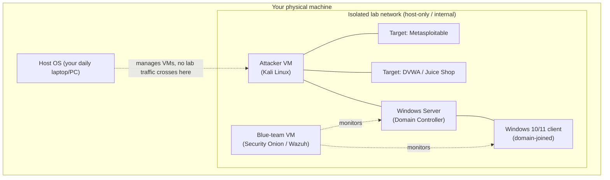

# Chapter 9 · Building Your Home Lab

> **Why this chapter matters:** This is where theory becomes skill. Your home lab is the isolated, legal playground where every attack and defense in the rest of this booklet actually happens. It's also, built and documented well, your first and most important portfolio piece. And it's the physical embodiment of the safety contract from Chapter 1 — the place where you can break anything without breaking the law.

> **By the end of this chapter you will:** have a working, *isolated* virtual lab with an attacker machine, vulnerable targets, and (optionally) a mini Active Directory + a blue-team monitoring stack — plus the discipline of snapshots and network isolation that keeps it all safe.

The exact VM configs, download links, and network settings are collected in [Appendix F: Lab Build Files](../appendices/F-lab-build-files.md). This chapter is the *why and the architecture*; Appendix F is the *click-by-click*.

---

## 9.1 The golden rule: isolation

> ⚠️ **Everything in your lab must be isolated from your home network and the internet by default.** You will run real malware, real exploits, and deliberately broken software. If any of it can reach your real devices or the internet, you risk infecting your own machines *and* — if a tool scans or attacks outward — committing unauthorized access against real systems. Isolation is not optional. It's the whole point.

The safe pattern is a **host-only / internal virtual network**: your VMs can talk to *each other* on a private virtual switch, but not to your home LAN or the internet. Your attacker VM and target VMs live on this island. When a specific lab genuinely needs internet (downloading updates, some TryHackMe-style connectivity), you enable it deliberately, briefly, and turn it back off.

---

## 9.2 Choosing your virtualization platform

You run multiple operating systems at once using a **hypervisor**.

| Option | Cost | Best for |
|---|---|---|
| **VirtualBox** | Free, open source | Beginners, any host OS. Start here if unsure. |
| **VMware Workstation Pro** | Free for personal use | Smoother performance/snapshots; popular in the industry. |
| **Proxmox VE** | Free, open source | A *dedicated* lab machine — best snapshots and virtual networking, runs headless. The upgrade path once you're serious. |
| **Apple Silicon Macs** | — | Use UTM or VMware Fusion; note ARM changes which target VMs run. See Appendix F notes. |
| **Cloud (AWS/Azure/GCP)** | Free tier + usage | When your hardware can't cope, or for cloud-security labs specifically. Set billing alerts! |

**Hardware reality (from Chapter's prerequisites doc):** 16 GB RAM is the practical minimum (2–3 VMs); 32 GB is comfortable (a small AD + blue-team lab). Enable virtualization extensions (VT-x/AMD-V) in your BIOS/UEFI. An SSD matters more than you'd think — snapshots and multiple VMs are I/O-heavy.

> **No powerful machine? You are not blocked.** Do most of Parts 2–4 on **TryHackMe / Hack The Box / PortSwigger**, which run the targets in *their* cloud and give you a browser-based attacker box. Build the local lab when you can. Not having a 32 GB rig is not an excuse to delay starting.

---

## 9.3 The core lab build (do this in stages)

Don't build everything at once. Add machines as the booklet needs them.

**Stage 1 — Attacker + first target (build now, for Parts 2–3):**
- **Kali Linux** (or Parrot OS) — the attacker VM, preloaded with the security toolkit. Give it 2–4 GB RAM.
- **Metasploitable 2** — a deliberately vulnerable Linux box, perfect first target for scanning, enumeration, and exploitation.
- Put both on the **same host-only network**. Confirm Kali can reach Metasploitable and *cannot* reach the internet or your home LAN.

**Stage 2 — Web targets (for Chapter 16):**
- **DVWA** (Damn Vulnerable Web Application) and **OWASP Juice Shop** — deliberately vulnerable web apps. Run them as Docker containers on a small Linux VM, or use the prebuilt VMs. These are your web-hacking range.

**Stage 3 — Windows / Active Directory lab (for Chapters 6, 18, and Windows detection):**
- **Windows Server** (free evaluation ISO) promoted to a **Domain Controller**.
- One or two **Windows 10/11** clients (free evaluation VMs) **joined to the domain**.
- Create a few users, groups, and a service account (with a deliberately weak password, for Kerberoasting practice later).
- This is the environment where you'll practice the AD attacks from Chapter 18 and the AD detections from Part 4. Building it *is* a major learning exercise.

**Stage 4 — Blue-team monitoring (for Part 4):**
- **Security Onion** (all-in-one IDS + SIEM + log management) *or* a **Wazuh + Elastic** stack, plus **Sysmon** on the Windows machines.
- Point your endpoints' logs at it. Now you can *attack from Kali and watch the detections light up on the blue side* — the single most valuable thing your lab can do, and the basis of the "attack-and-detect" portfolio project (Chapter 32).

---

## 9.4 Snapshots: your undo button

> ⚠️ **Snapshot every VM before every experiment.** A snapshot freezes the VM's exact state; if you break it (or infect it with malware you're analyzing), you roll back in seconds. Without snapshots, a broken lab means hours rebuilding. With them, breaking things is free — which is exactly the mindset you want.

Discipline: snapshot a "clean" baseline right after building each VM, and again before any risky lab. Name them clearly (`kali-clean`, `metasploitable-baseline`, `win10-before-malware-lab`).

---

## 9.5 Network configurations explained

Know these hypervisor networking modes — choosing the wrong one is the #1 lab safety mistake:

- **Host-only** — VMs talk to each other and the host, *not* the internet. **Your default for offensive/malware labs.**
- **Internal** — VMs talk only to each other, not even the host. Maximum isolation.
- **NAT** — VMs can reach the internet (through the host) but are hidden behind it; other machines can't easily reach in. Use *deliberately* when a lab needs updates/internet.
- **Bridged** — VMs appear as real devices on your home LAN. ⚠️ **Avoid for lab targets** — this puts vulnerable/infected machines directly on your real network.

The safe default: **host-only for the lab network**, and a temporary switch to NAT only when a specific machine needs to download something, then back.

---

## 9.6 Documenting your lab (this is portfolio gold)

From the very first VM, document your lab in a Git repository:
- A **network diagram** (the one in §9.1, adapted to your build).
- Each VM: OS, role, IP, purpose.
- Build notes and gotchas you hit.
- A README explaining the isolation model and how someone could reproduce it.

Why: (1) you'll forget how you set it up; (2) a well-documented lab is a concrete, credible portfolio piece that shows employers you can build and reason about environments — far more convincing than a cert alone; (3) writing it up *is* revision. Chapter 32 turns this into a polished portfolio entry.

---

## 9.7 Free platforms to complement (or replace) local labs

Your local lab and these are complementary — use both:

| Platform | Use for | Notes |
|---|---|---|
| **TryHackMe** | Guided learning, beginner→intermediate, blue and red | Best structured start; browser attacker box available |
| **Hack The Box / HTB Academy** | Less-guided challenge boxes, OSCP-style prep | Step up once comfortable |
| **PortSwigger Web Security Academy** | Web hacking (Chapter 16) | Free, the best web training that exists |
| **OverTheWire** | Linux/shell/binary wargames | Free; you started Bandit in Chapter 5 |
| **VulnHub** | Downloadable vulnerable VMs for your local lab | Free target variety |
| **picoCTF** | Beginner CTF challenges | Free, great for breadth |
| **LetsDefend / CyberDefenders / Blue Team Labs Online** | Defensive/SOC/DFIR simulations | For the Part 4 skills |

All of these grant authorization *in their terms of service* — which is exactly why they're safe (Chapter 3).

---

## Common mistakes

- **Bridged networking on a vulnerable/malware VM.** The most dangerous lab mistake — it puts broken machines on your real network. Use host-only.
- **No snapshots.** Turns every mistake into a rebuild. Snapshot obsessively.
- **Building everything before using anything.** Build in stages, as chapters need each machine. A four-VM lab you never touch teaches nothing.
- **Waiting for the "perfect" hardware.** Start on TryHackMe/PortSwigger today; grow the local lab over time.
- **Not documenting.** An undocumented lab is a missed portfolio piece and a future headache.
- **Letting the lab touch the internet by default.** Internet access is a deliberate, temporary exception, not the resting state.

---

## Labs

> **Lab 9.1 — Stage 1 build.** Install VirtualBox (or VMware). Create a host-only network. Install Kali and Metasploitable 2 on it. **Verify isolation:** from Kali, confirm you *can* ping Metasploitable and *cannot* reach the internet or your home router. Snapshot both as clean baselines. Document it in a new Git repo with a network diagram. (Full steps: Appendix F.)

> **Lab 9.2 — First contact.** From Kali, run `nmap` against Metasploitable and list its open ports. Don't exploit anything yet — just confirm your attacker can see your target. You've just built and validated a working offensive lab. Write it up.

> **Lab 9.3 — Web range.** Stand up DVWA and/or Juice Shop (Docker is easiest). Browse to them from Kali's browser. Confirm they load. This is your Chapter 16 range, ready to go.

> **Lab 9.4 — Sign up for the platforms.** Create free accounts on TryHackMe, Hack The Box, PortSwigger Web Security Academy, and picoCTF. Complete one intro room/challenge on each so you know how each works.

> **Lab 9.5 (later, revisit for Part 4) — Attack-and-detect loop.** Once you've added the Windows and blue-team stages, run a simple attack from Kali against a Windows host and find the corresponding event in your SIEM/Security Onion. This closing-the-loop exercise is the heart of your best future portfolio project.

---

## References and further reading

- **Appendix F: Lab Build Files** — the concrete, step-by-step configs, ISOs, and network settings for this chapter.
- **VirtualBox / VMware / Proxmox official docs** — for your chosen hypervisor's specifics.
- **Metasploitable 2 documentation (Rapid7)** and **VulnHub** ([vulnhub.com](https://www.vulnhub.com)) — target VMs and walkthroughs.
- **DetectionLab (by Chris Long)** — an automated, more advanced Windows+AD+monitoring lab build. Aspirational; study it once your manual lab works to see how pros automate lab provisioning.
- **Security Onion documentation** ([securityonionsolutions.com](https://securityonionsolutions.com)) and **Wazuh docs** — for the blue-team stage.
- **TryHackMe "Setup Your Own Lab" and networking rooms** — guided lab-building practice.
- **The prerequisites document** ([../../00-cybersecurity-foundations-and-prerequisites.md](../../00-cybersecurity-foundations-and-prerequisites.md)) §3 — hardware and software shopping list.

---

## Self-check

1. Why must your lab be isolated, and which networking mode is your safe default?
2. What is a snapshot and why should you take one before every experiment?
3. You have only 16 GB of RAM and a weak laptop. How do you still make real progress through Parts 2–4?
4. Which networking mode is the dangerous one for a vulnerable/malware VM, and why?
5. Why is a well-documented home lab considered a portfolio asset, not just a practice environment?

Answers

1. Because you run real malware, exploits, and deliberately vulnerable software that could infect your real machines or attack real systems if it reached your home network or the internet — that would also be unauthorized access (Chapter 3). Safe default: **host-only** (or internal) networking, isolated from your LAN and the internet.
2. A snapshot captures a VM's exact state at a point in time so you can restore it instantly. Taking one before each experiment lets you break, infect, or misconfigure the VM freely and roll back in seconds — enabling fearless practice.
3. Use browser-based platforms (**TryHackMe, Hack The Box, PortSwigger, picoCTF, LetsDefend**) that host the targets and an attacker box in their cloud, and run a minimal 2-VM local lab (Kali + one target) when needed. Add the heavier AD/blue-team stages later or in the cloud free tier.
4. **Bridged** networking — it places the VM directly on your real home LAN as if it were a physical device, so a vulnerable or infected machine can be reached by (or reach) your real devices, and outbound attacks would hit your real network.
5. Because building and documenting an isolated, multi-VM lab (with a network diagram, roles, and reproducible steps) demonstrates real, verifiable skill in systems, networking, and security architecture — concrete evidence employers value more than a certificate alone, and the writeup doubles as revision.

---

## What's next

**Part 1 is complete.** You can operate Linux and Windows, read networks, write tools, and you have a safe place to practice. You've built the foundation that most people skip — and it's exactly why you'll go further than they do.

Now [Part 2 · Security Core](../part-2-security-core/10-security-principles-and-threat-modeling.md) turns these foundations into *security thinking*: the principles, threat modeling, cryptography, identity, and adversary models that every specialization is built on. Chapter 10 begins with how to reason about what can go wrong — systematically, not by intuition.
