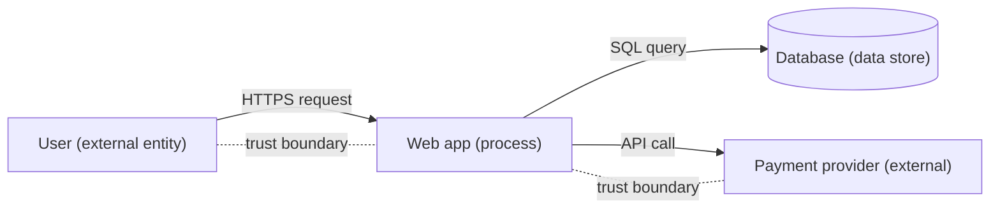

# Chapter 10 · Security Principles and Threat Modeling

> **Why this chapter matters:** Techniques change; principles don't. A practitioner who has memorized a hundred attacks but can't reason from principles will be lost the moment they meet the hundred-and-first. This chapter gives you the durable mental toolkit — the design principles that explain *why* controls exist, and threat modeling, the systematic method for finding what can go wrong *before* it does. This is the thinking that separates a technician from a security engineer.

> **By the end of this chapter you will:** be able to name and apply the core security design principles, threat-model a system using STRIDE and attack trees, and reason about risk quantitatively enough to prioritize. These are interview-favorite topics and daily-work skills.

---

## 10.1 The design principles (your permanent toolkit)

These principles, most dating to a foundational 1975 paper by Saltzer and Schroeder and refined since, underlie every good security decision. Learn to *invoke them by name* — it's how professionals justify choices.

**Least privilege** — every user, process, and component gets the *minimum* access needed to do its job, and no more. The single most important principle. Why: it shrinks the blast radius of any compromise. If a breached web server can only read one database table, the breach is contained; if it's running as root with access to everything, it's catastrophic. You saw the offensive flip side in Chapters 5–6 (privilege escalation) — least privilege is the defense.

**Defense in depth** — layer independent controls so no single failure is fatal. A phishing email might get past the filter, but macros are disabled, EDR flags the payload, network segmentation stops lateral movement, and monitoring catches the C2. Any one layer failing is survivable. (Recall the kill chain in Chapter 2 — you only need to break it once, so give yourself many chances.)

**Fail securely (fail-safe defaults)** — when something breaks, it should break into a *safe* state, and access should be *denied by default* (allowlist, not denylist). A door lock that opens when the power fails is a security disaster; one that stays locked fails securely. In code: if your authorization check errors out, deny access — don't accidentally grant it.

**Separation of duties** — split critical actions so no single person (or component) can complete them alone. The person who requests a payment can't also approve it. This limits both insider abuse and the damage from any single compromised account.

**Complete mediation** — check authorization on *every* access, every time — not just the first. Caching "you're allowed" and never rechecking is how privilege-escalation and stale-permission bugs happen.

**Economy of mechanism (keep it simple)** — the simpler a design, the smaller its attack surface and the easier it is to verify. Complexity is the enemy of security. Every feature, dependency, and option is potential attack surface.

**Open design (no security through obscurity)** — security must not depend on the *design* being secret; it should hold even if the attacker knows exactly how it works (this is why we trust *public*, peer-reviewed cryptography, not secret algorithms). Hiding things can add a *layer* (obscurity as one thin defense-in-depth measure is fine), but it must never be *the* security.

**Least common mechanism** — minimize shared resources/paths between users, because shared mechanisms are shared attack surface (a lesson relearned constantly in cloud multi-tenancy).

**Psychological acceptability** — if security is too painful, people bypass it (writing passwords on sticky notes, emailing files around the VPN). Secure systems must be *usable*, or humans will route around them. The best security is the easy path.

**Zero trust** (modern synthesis) — "never trust, always verify." Don't grant trust based on network location (being "inside" the firewall); authenticate and authorize every request continuously. It's least privilege + complete mediation applied to the whole architecture, and it's the dominant enterprise model now (Chapter 7).

> **How to use these:** when you evaluate any system or design, walk the list. "Is this least privilege? Does it fail secure? Is authorization mediated completely? Is it needlessly complex?" You'll find real weaknesses fast — and you'll sound like an engineer, not a tool-runner.

---

## 10.2 The vocabulary of risk (get this exact)

Sloppy vocabulary produces sloppy thinking. Nail these distinctions; interviewers probe them:

- **Asset** — something of value you're protecting (data, a system, a reputation, a life).
- **Vulnerability** — a weakness (a bug, a misconfiguration, an untrained employee).
- **Threat** — a potential cause of harm (an actor or event that could exploit a vulnerability).
- **Threat actor** — the specific who (Chapter 2).
- **Exploit** — the actual method/code that takes advantage of a vulnerability.
- **Risk** — the *combination*: the likelihood a threat exploits a vulnerability, times the impact if it does. **Risk = Likelihood × Impact.**

Worked distinction: An unpatched web server (**vulnerability**) holding customer data (**asset**) could be attacked by ransomware crews (**threat actor**) using a known exploit (**exploit**). The **risk** is high because exploitation is likely (public exploit exists, server is internet-facing) and impact is severe (data loss + downtime). Patch it and you've reduced the *likelihood* to near zero — risk drops even though the asset's value is unchanged.

**You cannot eliminate risk, only manage it.** The four options (Chapter 30 formalizes these):
- **Mitigate** — reduce likelihood or impact (patch, add a control).
- **Transfer** — shift it (cyber insurance, outsourcing).
- **Accept** — decide it's tolerable and do nothing (consciously, documented).
- **Avoid** — stop doing the risky thing entirely.

Security is applied risk management. Every control costs money/time/usability, so you spend where risk is highest — which is why you must be able to *estimate* risk, not just spot vulnerabilities.

---

## 10.3 Threat modeling: finding trouble on purpose

Threat modeling is the disciplined practice of asking, *before* you're attacked: what are we building, what can go wrong, what will we do about it, and did we do a good job? It's how you find design flaws that no scanner catches (scanners find known bugs; threat modeling finds *design* weaknesses).

**The four framing questions** (Adam Shostack's formulation — memorize them):
1. **What are we working on?** (Model the system.)
2. **What can go wrong?** (Find threats.)
3. **What are we going to do about it?** (Mitigate.)
4. **Did we do a good enough job?** (Validate.)

### Step 1: Model the system with a data flow diagram (DFD)
Draw the system as **processes** (things that act), **data stores** (things that hold data), **external entities** (users, other systems), **data flows** (arrows), and — critically — **trust boundaries** (where data crosses from less-trusted to more-trusted, e.g., the internet → your server, or user input → your database).



**Trust boundaries are where attacks happen** — every arrow crossing one is a place to ask "what if this data is malicious?"

### Step 2: Find threats with STRIDE
**STRIDE** is a mnemonic for six threat categories — walk each element of your DFD against all six:

| Letter | Threat | Violates | Example |
|---|---|---|---|
| **S** | **Spoofing** | Authentication | Attacker pretends to be another user |
| **T** | **Tampering** | Integrity | Modifying data in transit or at rest |
| **R** | **Repudiation** | Non-repudiation | User denies doing something; no audit trail |
| **I** | **Information disclosure** | Confidentiality | Leaking data |
| **D** | **Denial of service** | Availability | Making the system unusable |
| **E** | **Elevation of privilege** | Authorization | Gaining more rights than allowed |

Notice STRIDE maps directly onto the CIA triad + auth concepts from Chapter 2 — that's not a coincidence; it's the same properties, viewed as *threats* instead of *goals*. For each element/flow, ask all six: "Can this be spoofed? Tampered? ..." You'll surface concrete, actionable threats.

### Step 3: Attack trees (drilling into a specific goal)
For a high-value threat, build an **attack tree**: the attacker's goal at the root, and the ways to achieve it branching below (with AND/OR nodes).

```
GOAL: Read another user's private messages
├── OR: Exploit broken access control (change user_id in request)   ← IDOR
├── OR: Steal their session
│   ├── OR: XSS to grab their cookie
│   └── OR: Session fixation
├── OR: Compromise the database directly (SQL injection)
└── OR: Social-engineer a support agent into resetting the account
```

Attack trees make you think like the adversary and reveal that the "obvious" defense (say, fixing SQLi) leaves other branches open — driving you back to defense in depth.

### Step 4: Mitigate and validate
For each real threat, choose a mitigation (map STRIDE → controls: Spoofing → strong auth; Tampering → integrity checks/signing; Info disclosure → encryption/access control; DoS → rate limiting/redundancy; EoP → least privilege). Then validate: did you address the important ones? Threat modeling is iterative — you revisit it as the system changes.

---

## 10.4 A worked mini threat model

**System:** a simple "leave request" web app. Employees submit requests; managers approve.

1. **Model:** browser → web app → database; auth via login; a manager role.
2. **Threats (STRIDE, selected):**
   - *Spoofing:* Could an employee log in as their manager? (Weak passwords, no MFA.)
   - *Tampering:* Could an employee change the `status` field directly to "approved"? (Trusting client input.)
   - *Elevation of privilege:* Could an employee call the "approve" endpoint by guessing its URL? (Missing server-side authorization — the classic broken access control.)
   - *Information disclosure:* Could employee A read employee B's requests by changing an ID? (IDOR.)
   - *Repudiation:* If a manager denies approving something, is there an audit log?
3. **Mitigations:** MFA (spoofing); server-side authorization checks on every action, never trust client-set status/role (tampering, EoP); object-level access checks (IDOR); immutable audit logging (repudiation).
4. **Validate:** the biggest risks are the authorization flaws (high likelihood — trivial to attempt; high impact — anyone approves anything). Fix those first.

Notice you found the most dangerous bugs (broken access control — the #1 web risk) *from the design*, with no code and no tools. That's the power of threat modeling, and it's why it's done early and often.

---

## Common mistakes

- **Reaching for tools before thinking.** Scanners find known bugs; threat modeling finds design flaws. Do the thinking first.
- **Confusing vulnerability with risk.** A vulnerability on an isolated, worthless system is low risk; the same vuln on a crown-jewel system is critical. Context is everything.
- **Trying to eliminate all risk.** Impossible and wasteful. Prioritize by Likelihood × Impact and spend where it counts.
- **Security through obscurity as the *only* defense.** Fine as a thin extra layer; fatal as the foundation.
- **Threat modeling once and never again.** Systems change; the model must too.
- **Ignoring psychological acceptability.** Controls people hate get bypassed, making you less secure than a weaker control they actually use.

---

## Labs

> **Lab 10.1 — Principle audit.** Pick a system you know well (an app you built, or your home lab). For each of the design principles in §10.1, write one sentence on whether it's honored or violated. You'll find real weaknesses — that's the point.

> **Lab 10.2 — Full threat model.** Choose a simple app (a to-do app, a blog, your future portfolio site). (1) Draw its data flow diagram with trust boundaries. (2) Run STRIDE across each element and list at least eight concrete threats. (3) Build an attack tree for the single worst one. (4) Propose mitigations. Write it up — this is an outstanding portfolio artifact and exactly what AppSec engineers do.

> **Lab 10.3 — Risk ranking.** Take the threats from Lab 10.2 and rank them by Likelihood × Impact (use High/Medium/Low for each). Justify your top three. This trains the prioritization judgment that separates senior from junior.

> **Lab 10.4 — Read a real threat model.** Find a published threat model (many open-source projects and cloud providers publish them). Compare its structure to yours. Note what they cover that you missed.

---

## References and further reading

- **Adam Shostack — *Threat Modeling: Designing for Security*.** The definitive book. The four questions and STRIDE come from here. Read at least the first third; it's directly, immediately useful.
- **Saltzer & Schroeder — "The Protection of Information in Computer Systems" (1975).** The origin of the design principles. Short, historic, still relevant. Free online.
- **Ross Anderson — *Security Engineering* (3rd ed., free online).** Chapters on security principles and economics of security. The deepest treatment; return to it repeatedly.
- **OWASP Threat Modeling** — [owasp.org](https://owasp.org) resources, plus the free **OWASP Threat Dragon** tool for drawing DFDs and applying STRIDE.
- **NIST SP 800-30** — Guide for Conducting Risk Assessments. The formal risk methodology (you'll revisit in Chapter 30).
- **Bruce Schneier — "Attack Trees" (1999)** and his book *Secrets and Lies* for the risk-thinking mindset.

---

## Self-check

1. State the principle of least privilege and explain how it limits the damage of a compromise.
2. Precisely distinguish vulnerability, threat, exploit, and risk using a single example.
3. What are the four framing questions of threat modeling, and what does each produce?
4. Run STRIDE against a login form: give one concrete threat for at least four of the six letters.
5. Why is "security through obscurity" acceptable as a layer but fatal as a foundation?

<details>
<summary>Answers</summary>

1. Every entity gets the minimum access required and no more. If a component is compromised, the attacker inherits only that minimal access, so the **blast radius** is small — a breached low-privilege web process can't reach the whole environment the way a root/admin one could.
2. A **vulnerability** is a weakness (unpatched server); a **threat** is a potential cause of harm that could exploit it (ransomware crew); an **exploit** is the actual method/code used (a public RCE exploit); **risk** is Likelihood × Impact of that threat exploiting that vulnerability against a valued asset (high, if internet-facing with sensitive data).
3. (1) What are we working on? → a system model/DFD. (2) What can go wrong? → a list of threats (via STRIDE/attack trees). (3) What are we going to do about it? → mitigations. (4) Did we do a good enough job? → validation/review.
4. Examples: **Spoofing** — logging in as another user via credential stuffing; **Tampering** — modifying the request to elevate a role field; **Information disclosure** — verbose errors revealing whether a username exists; **Denial of service** — flooding login to lock out accounts; **Elevation of privilege** — an auth bypass granting admin; **Repudiation** — no logging so a malicious login can't be attributed.
5. As a layer it adds a small extra cost to the attacker (defense in depth) without being relied upon. As a foundation it fails the *open design* principle: once the secret design leaks (and it will), all security evaporates — whereas well-designed security holds even when the attacker knows exactly how it works.

</details>

---

## What's next

You can now reason about security systematically. One of the most important controls you'll reason about — and one beginners most often misuse — is cryptography. [Chapter 11](11-applied-cryptography.md) teaches you to *use* crypto correctly and *spot its misuse*, without the academic math that scares people off. It's the tool that provides confidentiality and integrity across the entire field.
