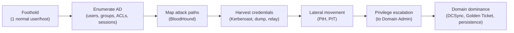

# Chapter 18 · Active Directory Attack Paths

> **Why this chapter matters:** This is the most important offensive skill for enterprise environments, full stop. Real corporate breaches are overwhelmingly AD compromises: an attacker gets a foothold as a normal user and, through a chain of misconfigurations and protocol abuses, becomes Domain Admin — owning everything. If you can walk this path (and, from the blue side, detect it), you're working at the level enterprises actually pay for. Chapter 6 gave you the theory; here it becomes a hands-on kill chain.

> **By the end of this chapter you will:** enumerate AD as an attacker, map attack paths with BloodHound, perform Kerberoasting/AS-REP roasting, use Pass-the-Hash/Pass-the-Ticket, understand DCSync and Golden Tickets, and — critically — know how each is detected and prevented.

> ⚠️ Build the AD lab from Chapter 9 / Appendix F and attack *that*. Never touch a domain you don't own or aren't authorized to test.

---

## 18.1 The AD attack lifecycle

Enterprise AD attacks follow a repeatable pattern — recognize it and every technique finds its place:



You already have the foothold skills (Chapters 16–17). This chapter is stages B–G. The recurring theme from Chapter 6: these abuse **designed behavior**, so defense is about hardening and monitoring legitimate mechanisms, not patching bugs.

---

## 18.2 Enumeration from inside the domain

With any domain user's credentials (even a low-privileged one), you can query AD extensively via LDAP — because authenticated users can *read* most of the directory by design.

- **Tools:** `BloodHound`/`SharpHound` (collectors), `ldapsearch`, PowerView (PowerShell), `enum4linux-ng`, `nxc`/NetExec (formerly CrackMapExec), `rpcclient`.
- **What you gather:** all users and groups (especially privileged groups — Domain Admins, etc.), computers, **service accounts** (SPNs — the Kerberoasting targets), **ACLs** (who has rights over whom — the hidden attack paths), group memberships, active sessions (where privileged users are logged in — your lateral-movement targets), password policy, and trusts.

The goal: find the *path* from where you are to Domain Admin. That's often not a straight line but a chain of "user A can reset user B's password, who is in group C, which has admin rights on server D, where a Domain Admin has a session..." — which is exactly what BloodHound reveals.

---

## 18.3 BloodHound: mapping the graph

**BloodHound** is the single most important AD tool for both attackers and defenders. It ingests the enumeration data (collected by SharpHound) and represents AD as a **graph** — nodes (users, computers, groups) and edges (relationships: `MemberOf`, `AdminTo`, `HasSession`, `CanRDP`, ACL rights like `GenericAll`, `WriteDACL`). Then it answers the killer query: **"Shortest path from [my foothold] to Domain Admins."**

It reveals attack paths humans would never find manually — a chain of five innocuous permissions that together lead from a helpdesk account to domain dominance. Attackers use it to plan; **defenders use it to find and cut those paths** (attack-path management — the modern approach to AD defense). Learning to read a BloodHound graph is a core skill on both sides.

---

## 18.4 The credential-access techniques (from Chapter 6, now hands-on)

### Kerberoasting (T1558.003)
*Any* domain user can request a Kerberos service ticket (TGS) for any account with an SPN (service accounts). That ticket is encrypted with the service account's password-derived key → request it, extract it, crack it offline (hashcat) → recover the service account's password. Service accounts are often over-privileged with weak, non-expiring passwords → frequent path to escalation.
```
Tools:  Rubeus (Windows), impacket-GetUserSPNs (Linux)
Flow:   list SPNs → request TGS → export hash → hashcat → plaintext password
```
**Detection:** anomalous volume/pattern of TGS requests (Event **4769**), especially for RC4-encrypted tickets. **Prevention:** strong 25+ char passwords or **gMSA** (group Managed Service Accounts, auto-rotated) for service accounts; least privilege.

### AS-REP Roasting (T1558.004)
For accounts with "Kerberos pre-authentication disabled," an attacker can request AS-REP material crackable offline — *without valid credentials first*. **Prevention:** don't disable pre-auth; strong passwords. **Detection:** Event 4768 anomalies.

### Credential dumping (T1003)
On a compromised host: dump **LSASS** (Mimikatz, comsvcs) for cached credentials/tickets; dump the local **SAM**; on a DC, the whole **NTDS.dit**. Yields hashes and tickets for reuse. **Prevention:** Credential Guard, LSASS protection, tiered admin (don't log privileged accounts into low-trust hosts). **Detection:** LSASS access by unusual processes (a premier EDR detection).

---

## 18.5 Lateral movement (from Chapter 6, hands-on)

Reuse harvested credentials to move across the network *without* cracking anything:

- **Pass-the-Hash (PtH, T1550.002)** — authenticate with a stolen NT hash over NTLM. Tools: `nxc/NetExec`, `impacket-psexec/wmiexec`, Mimikatz.
- **Pass-the-Ticket (PtT, T1550.003)** — inject a stolen/forged Kerberos ticket and use it.
- **Overpass-the-Hash / Pass-the-Key** — use a hash to get a Kerberos TGT.
- **Execution methods across hosts:** PsExec, WMI (`wmiexec`), WinRM (`evil-winrm`), DCOM, scheduled tasks — using valid creds/hashes. **NTLM relay** (capturing and relaying authentication, e.g., via `responder` + `ntlmrelayx`) is another powerful path when signing isn't enforced.

**Detection:** anomalous logon types and patterns (Event 4624 type 3), lateral authentication from unusual sources, service creation on remote hosts (7045), NTLM where Kerberos is expected. **Prevention:** SMB signing, disabling NTLM where possible, network segmentation (Chapter 7), tiered administration, least privilege.

---

## 18.6 Domain dominance

Once you reach high privilege:

- **DCSync (T1003.006)** — with replication rights (which Domain Admins and some delegated accounts have), *ask a DC to replicate* account secrets — extracting any account's hash, including **krbtgt**, without touching the DC's disk. Stealthy. **Detection:** replication requests (Event 4662 / directory replication) from non-DC accounts is a high-fidelity alert. **Prevention:** tightly control who has replication rights; monitor for it.
- **Golden Ticket (T1558.001)** — with the **krbtgt** hash, forge TGTs for *any user with any privileges*, valid until krbtgt is rotated *twice*. Total, persistent domain compromise. **Silver Ticket** — forge a service ticket for one service using that service's key (stealthier, narrower).
- **Persistence at the domain level** — AdminSDHolder abuse, DCShadow, malicious GPOs, Skeleton Key, adding backdoor accounts to privileged groups. **Recovery from a Golden Ticket requires double-rotating krbtgt** — which is why domain compromise is so serious.

> **The whole point for defenders:** because these abuse legitimate replication, ticketing, and delegation, you can't "patch" them away — you **monitor** the legitimate mechanisms for abuse (the Event IDs above), **harden** (tiered admin, gMSA, least privilege, SMB signing, remove excess ACLs), and **reduce attack paths** with BloodHound. This is the core of enterprise blue-team work in Part 4.

---

## 18.7 The defender's mirror (purple teaming AD)

For every technique, note the pairing — this is the purple-team scorecard from Chapter 13:

| Attack | Detect (data source) | Prevent |
|---|---|---|
| Enumeration | Anomalous LDAP queries; SharpHound patterns | Least privilege; limit readable attributes |
| Kerberoasting | 4769 (RC4/volume anomalies) | gMSA, strong passwords, least privilege |
| Credential dumping | LSASS access by odd processes (EDR) | Credential Guard, tiered admin |
| Pass-the-Hash/Ticket | 4624 type-3 anomalies, remote-exec artifacts | SMB signing, disable NTLM, segmentation |
| DCSync | 4662 replication from non-DCs | Restrict replication rights; monitor |
| Golden Ticket | Tickets with anomalous lifetimes/RC4; krbtgt use | Protect krbtgt; rotate; detect forged tickets |

If you can produce this table from memory and demonstrate both sides in your lab, you understand enterprise security at a level most beginners never reach.

---

## Common mistakes

- **Skipping the AD lab build.** You cannot learn this from reading. Build the Chapter 9 lab and run the chain end to end.
- **Learning attacks without detections.** Half the value (and most of the jobs) is on the blue side. Do both in your lab.
- **Treating these as exotic exploits.** They abuse *designed behavior* — that's what makes them ubiquitous and unpatchable, and why monitoring matters.
- **Ignoring BloodHound.** It's the map. Attackers and defenders both live in it.
- **Not connecting to Chapter 6.** The Kerberos/NTLM mechanics *are* the reason these work. If a technique feels like magic, reread Chapter 6.

---

## Labs

> **Lab 18.1 — Enumerate your AD lab.** With a low-priv domain user, run SharpHound to collect data and load it into BloodHound. Explore the graph. Run the "Shortest Path to Domain Admins" query. Document the paths you find. This alone teaches you how AD attack paths form.

> **Lab 18.2 — Kerberoast.** Create a service account with an SPN and a weak-ish password (you did this in Chapter 6). As a normal user, request its ticket (`impacket-GetUserSPNs` or Rubeus), crack it with hashcat, recover the password. Then find Event 4769 in your logs and note what the detection looks like. Full attack-and-detect writeup — portfolio gold.

> **Lab 18.3 — Pass-the-Hash lateral movement.** Dump a hash on one host, then use PtH (`nxc smb`/`impacket-psexec`) to authenticate to another host with it — no cracking. Observe the logon events generated. Write up the technique and its detection.

> **Lab 18.4 — DCSync + Golden Ticket (lab).** With appropriately-privileged creds in your lab, perform DCSync to extract the krbtgt hash, then forge a Golden Ticket (Mimikatz/Rubeus/impacket) and use it. Then find the detection signals (4662 replication, ticket anomalies). ⚠️ Your own lab domain only — this is total compromise; never near a real domain.

> **Lab 18.5 — Guided paths.** Complete TryHackMe's "Attacking Active Directory"/"Post-Exploitation" content and HTB Academy's AD modules. Then do an HTB AD-focused box or Pro Lab. These consolidate everything.

> **Lab 18.6 — Blue-team the whole chain.** Re-run Labs 18.2–18.4 with your Chapter 9 blue-team stack (Sysmon + SIEM) collecting. Build detections for each step. This "attack then detect the exact same thing" project is the single most impressive portfolio piece a beginner can have.

---

## References and further reading

- **adsecurity.org (Sean Metcalf)** — the definitive free resource on AD attacks/defense (Kerberoasting, DCSync, Golden Ticket, mitigations). Read extensively.
- **The Hacker Recipes — AD section** ([thehacker.recipes](https://www.thehacker.recipes)) — structured, mechanism-focused catalog of every AD attack. Excellent during labs.
- **BloodHound docs** — [bloodhound.specterops.io](https://bloodhound.specterops.io) — and SpecterOps' blog on attack-path management (the defensive framing).
- **HackTricks — Active Directory Methodology** — the practical "what next?" reference.
- **Impacket, Rubeus, Mimikatz, NetExec/nxc** — the core toolsets; read their docs and *understand* what each command does.
- **TryHackMe / HackTheBox Academy AD paths** — the best guided hands-on.
- **Microsoft — "Securing Privileged Access" / tiered administration model** — the authoritative defensive architecture.
- **"Detecting Kerberoasting", "Detecting DCSync"** — search these; multiple vendors publish detailed detection guidance mapping to Event IDs.

---

## Self-check

1. Why can a *low-privileged* domain user enumerate almost the entire directory, and why is that a problem?
2. Walk through Kerberoasting end to end, and give its detection Event ID and its prevention.
3. Explain how BloodHound turns a pile of AD data into an attack path, and how defenders use the same tool.
4. What is DCSync, why is it stealthy, and what is its high-fidelity detection?
5. Why does recovering from a Golden Ticket require rotating krbtgt *twice*, and what does that tell you about the severity of domain compromise?

<details>
<summary>Answers</summary>

1. Because AD is designed so authenticated users can *read* most directory objects (users, groups, SPNs, ACLs, group memberships) to function normally. It's a problem because that read access lets any compromised account map privileged groups, service accounts (Kerberoasting targets), sessions, and ACL-based attack paths — everything needed to plan a route to Domain Admin.
2. Any domain user requests a Kerberos service ticket (TGS) for an account with an SPN; the ticket is encrypted with that service account's password-derived key; the attacker exports it and cracks it **offline** with hashcat to recover the (often weak) password, then uses that account's privileges. Detection: **Event 4769** (anomalous/RC4 TGS request volume). Prevention: **gMSA** or strong 25+ character passwords for service accounts + least privilege.
3. BloodHound models AD as a graph of nodes (users/computers/groups) and edges (relationships/rights like MemberOf, AdminTo, GenericAll, HasSession), then computes the shortest path from a starting node to Domain Admins — surfacing multi-step chains of individually-innocuous permissions that humans miss. Defenders run it to *find and cut* those same paths (attack-path management).
4. DCSync abuses directory **replication** rights to ask a DC to hand over account password data (any hash, including krbtgt) as if the attacker were another DC — no code on the DC, no touching NTDS.dit on disk, so it's stealthy. High-fidelity detection: replication requests (**Event 4662** / directory-replication) originating from accounts/hosts that are **not** Domain Controllers.
5. Because Kerberos keeps the current and previous krbtgt keys valid; rotating once leaves the old (compromised) key still accepted, so a forged Golden Ticket keeps working — you must rotate twice to invalidate it. This shows domain compromise is catastrophic and persistent: even after eviction, an attacker with the krbtgt hash retains god-mode until a careful double rotation, which is why protecting krbtgt and detecting DCSync are top priorities.

</details>

---

## What's next

You can execute a full enterprise attack chain — and detect it. The final offensive chapter turns all of this into a *professional deliverable*. [Chapter 19](19-professional-penetration-testing-and-reporting.md) covers how real engagements are scoped, executed, and — most importantly — *reported*, because the report is the product the client actually pays for, and report-writing is the skill that gets offensive people hired.
