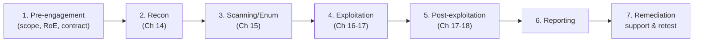

# Chapter 19 · Professional Penetration Testing and Reporting

> **Why this chapter matters:** Everything in Chapters 14–18 was *technique*. This chapter is *the job*: how a real engagement is scoped, run, and — above all — **reported**. The report is the product the client pays for; a brilliant hack described in a confusing report is worthless, and a modest finding communicated clearly and actionably is gold. Report-writing and professionalism are what actually get offensive people hired and promoted — far more than one more exploit. Beginners neglect this; you won't.

> **By the end of this chapter you will:** understand the phases and types of a professional engagement, the standards/methodologies, how to write a finding and a full report, how to rate severity, and the soft skills (communication, client management) that define a professional tester.

---

## 19.1 Engagement types

Not all offensive work is the same. Know the distinctions (interviewers and clients ask):

- **Vulnerability assessment** — automated + light manual identification of weaknesses (Chapter 15). Breadth over depth.
- **Penetration test** — scoped, human-driven exploitation to demonstrate real impact. Types by *knowledge given*:
  - **Black box** — tester knows nothing (simulates an external attacker). Realistic, but time spent on recon.
  - **White box** — full information/source/credentials provided. Efficient, thorough, finds the most.
  - **Gray box** — partial (e.g., a standard user account). A common, cost-effective middle ground.
- **Red team engagement** — objective-based, stealthy, long adversary *emulation* (e.g., "reach the crown-jewel database without being caught"), testing *detection and response*, not just finding bugs. Uses ATT&CK emulation (Chapter 13).
- **Purple team** — red and blue collaborating live to build detections (Chapters 2, 13, 18).
- **Bug bounty** — crowdsourced, pay-per-valid-finding, ongoing (Chapter 3 — your legal on-ramp to real-world offense).
- **Specialized:** web app, mobile, API, cloud, wireless, social engineering, physical, IoT/OT.

Scope and rules of engagement (Chapter 3) define every one of these before a single packet is sent.

---

## 19.2 The engagement lifecycle



1. **Pre-engagement** — scoping, rules of engagement, contracts, authorization (Chapter 3). Get this *exactly* right; it's legal and professional bedrock. Define objectives, scope, timing, constraints, emergency contacts, and the "get out of jail" letter.
2. **Reconnaissance** (Chapter 14).
3. **Scanning & enumeration** (Chapter 15).
4. **Exploitation** (Chapters 16–17).
5. **Post-exploitation** — demonstrate *impact* (lateral movement, data access) within RoE (Chapters 17–18).
6. **Reporting** — the deliverable (below).
7. **Remediation support & retest** — help the client fix, then verify the fixes hold. This is where you build the trust that earns repeat business.

Throughout: **take contemporaneous notes and evidence** (screenshots, request/response, commands, timestamps). You cannot write a good report from memory, and you may need to prove exactly what you did and when. Your Chapter 1 note system is the backbone of this.

---

## 19.3 Standards and methodologies

Professionals work to recognized frameworks (cite them; they signal competence):
- **PTES (Penetration Testing Execution Standard)** — the classic end-to-end methodology.
- **OWASP Testing Guide / WSTG** — the authority for web app testing (Chapter 16).
- **OSSTMM** — a rigorous, metrics-driven methodology.
- **NIST SP 800-115** — the U.S. government technical guide to security testing.
- **MITRE ATT&CK** — for red team emulation and mapping findings to adversary behavior (Chapter 13).
- **PTES / OWASP / NIST** together cover most engagements. Following a standard means you don't miss whole categories and the client gets consistent, defensible coverage.

---

## 19.4 Writing a finding (the core skill)

A **finding** is one vulnerability, written so a busy reader can understand, prioritize, and fix it. Every finding has a consistent structure:

```
FINDING: Broken Access Control — IDOR in Invoice Endpoint

Severity: High   (CVSS 8.1 / your risk rating)
Affected: https://app.client.com/api/invoices/{id}

Description:
  The invoice API returns any invoice by ID without verifying the
  requesting user owns it. An authenticated user can enumerate {id}
  to read all customers' invoices, including names, addresses, and
  amounts.

Impact:
  Full disclosure of all customers' billing data (confidentiality
  breach; likely GDPR-reportable). ~40,000 records exposed.

Steps to Reproduce:
  1. Log in as a standard user; capture the request to /api/invoices/1001.
  2. In Burp Repeater, change id to 1002. Observe another user's invoice.
  3. Script the range 1–50000 to confirm mass exposure. [screenshot]

Evidence:
  [request/response screenshots, sample redacted data]

Remediation:
  Enforce server-side authorization on every invoice access: verify the
  authenticated user owns the requested invoice before returning it.
  Deny by default. Consider non-sequential identifiers as defense in depth.

References:
  OWASP A01:2021 Broken Access Control; CWE-639.
```

**What makes a finding good:**
- **Clear, calm, factual tone** — no hype, no jargon-for-its-own-sake. You're helping, not showing off.
- **Impact in business terms** — "an attacker can read all customer billing data and it's likely a reportable breach" beats "IDOR in the invoice endpoint." Executives fund fixes based on *impact*, not vulnerability names.
- **Reproducible steps + evidence** — the client's team must be able to confirm it.
- **Actionable, correct remediation** — this is where your understanding of the *fix* (every chapter's "Fix:" lines) pays off. A finding without a real remediation is half-done.
- **Accurate severity** — neither inflated (erodes trust) nor buried (dangerous). Honesty (Chapter 3).

---

## 19.5 The full report structure

A professional report has two audiences and is structured for both:

1. **Executive Summary** (for management, non-technical) — the *business* story: what was tested, the overall risk posture, the most important findings in plain language, and prioritized recommendations. Often the only part executives read; it must stand alone. No jargon.
2. **Methodology & Scope** — what was tested, when, how, under what rules. Establishes rigor and boundaries.
3. **Findings** (for technical teams) — each finding as in §19.4, ordered by severity. The bulk of the report.
4. **Overall risk narrative / attack path** — often the most valuable part: "here's how I chained these findings from an external position to full domain compromise" — the story that makes the abstract findings viscerally real to decision-makers.
5. **Remediation roadmap** — prioritized, realistic guidance (quick wins vs strategic fixes).
6. **Appendices** — tooling, raw data, full evidence.

> **The report *is* the deliverable.** A client can't see your skill; they see your report. Clarity, accuracy, professional tone, and actionable remediation are what get you rehired and referred. Practice writing reports as deliberately as you practice hacking — it's the higher-leverage skill for your career.

---

## 19.6 Severity and risk rating

Rate findings so clients prioritize correctly:
- **CVSS** for a standardized technical score (Chapter 15) — but state it's context-blind.
- **Business risk rating** (Critical/High/Medium/Low/Info) that factors in *this client's* context: asset value, exposure, exploitability, and real-world impact (Chapter 10's Risk = Likelihood × Impact). A CVSS-medium bug on the crown-jewel database facing the internet may be *your* Critical.
- Be consistent across the report and justify ratings. Consistency and honesty build the trust the whole relationship rests on.

---

## 19.7 The soft skills that define a professional

Technical skill gets you in the door; these keep you employed and get you promoted:
- **Communication** — explaining a complex flaw to a non-technical stakeholder, calmly and without condescension. The most valued skill in senior offensive roles.
- **Professionalism & discretion** — you hold the client's worst secrets (Chapter 3). Confidentiality, reliability, and humility matter enormously.
- **Empathy for defenders/developers** — the people fixing your findings are overworked and did their best. "Here's the problem *and* a realistic fix" beats "your code is terrible." You want them to *act* on your report, which requires them not resenting it.
- **Managing findings responsibly** — if you find something critical mid-test (or evidence of a *real* ongoing breach), you stop and notify per RoE immediately (Chapter 3), not save it for the report.
- **Honesty about limits** — "we didn't have time to fully test X" is professional; pretending you covered everything is not.

---

## Common mistakes

- **Neglecting reporting.** The most common beginner mistake. The report is the job; practice it like one.
- **Writing for yourself, not the reader.** Executives need impact and plain language; developers need reproducible steps and fixes. Serve both.
- **Vague or missing remediation.** "Fix the SQLi" is useless. "Use parameterized queries; here's the pattern" is actionable.
- **Inflating or burying severity.** Both destroy trust — the currency of the whole career (Chapter 3).
- **No evidence / not reproducible.** A finding the client can't confirm won't get fixed and makes you look sloppy.
- **Poor bedside manner.** Condescension gets your report ignored. You're on the same side as the defenders.
- **Skipping the standard/methodology.** Ad hoc testing misses categories and looks amateur; cite PTES/OWASP/NIST.

---

## Labs

> **Lab 19.1 — Write a professional finding.** Take one vulnerability you exploited in Chapters 16–18 and write it up as a formal finding (§19.4 structure) with real evidence from your lab. This is a top portfolio artifact — employers *love* seeing you can communicate, not just exploit.

> **Lab 19.2 — Write a full mini-report.** Do a complete mini-engagement against a HTB/THM box or your lab (recon → root), then write a full report: executive summary, methodology, 3–5 findings ordered by severity, an attack-path narrative, and a remediation roadmap. Use a real template (see references). This single document demonstrates the entire Part 3 skill set and is arguably the most valuable thing in your portfolio.

> **Lab 19.3 — Executive summary practice.** Take a technical finding and write two versions of its impact: one for a developer, one for a CEO. Notice how different they must be. This translation skill is rare and highly valued.

> **Lab 19.4 — Severity calibration.** Take five findings and rate each with CVSS *and* a context-adjusted business risk rating for a fictional client (a hospital vs a marketing site — same bug, different risk). Justify the differences. Trains the judgment senior testers are paid for.

> **Lab 19.5 — Use a real template.** Download a professional pentest report template (see references) and reformat Lab 19.2 into it. Familiarity with real report formats is directly job-relevant.

---

## References and further reading

- **PTES** — [pentest-standard.org](http://www.pentest-standard.org) — the execution standard. Read the whole methodology.
- **NIST SP 800-115** — *Technical Guide to Information Security Testing and Assessment*. Free, authoritative.
- **OWASP Web Security Testing Guide (WSTG)** — the web testing bible (Chapter 16).
- **TCM Security — sample pentest reports & report-writing guidance** (their GitHub and courses). Practical, current examples of what a real report looks like.
- **"Writing a Penetration Testing Report" — SANS reading room** (free whitepaper). Classic, still relevant.
- **PentestReports / public report repositories** — collections of real (sanitized) reports to study structure and tone.
- **OffSec / PWK report requirements** — even if you don't take OSCP yet, its report standards teach professional documentation.
- **Carl Pearson / general — "The Pentester Blueprint" (Phillip Wylie & Kim Crawley)** — on building the *career* side of offensive security.

---

## Self-check

1. Why is the report considered the actual product of a penetration test, and what are its two audiences?
2. What are the essential elements of a well-written finding, and which one do beginners most often get wrong?
3. A vulnerability has a CVSS of 5.5 (medium). Why might you still rate it Critical for a specific client?
4. Distinguish a penetration test from a red team engagement.
5. You discover evidence of a *real, ongoing* breach during an authorized test. What do you do, and why?

<details>
<summary>Answers</summary>

1. Because the client can't observe your skill directly — they receive and act on the report, so its clarity, accuracy, and actionable remediation determine the engagement's value (and whether you're rehired). Its two audiences: **management/executives** (the executive summary — business impact, plain language) and **technical teams** (the findings — reproducible steps, evidence, and fixes).
2. Clear factual description, business-terms **impact**, reproducible steps + evidence, accurate severity, and **actionable, correct remediation**, citing standards (OWASP/CWE). Beginners most often get **remediation** wrong (vague or missing) — and neglect writing impact in business terms.
3. Because CVSS is context-blind; for this client the affected asset may be crown-jewel data, internet-exposed, and easily exploited, so real risk (Likelihood × Impact) is much higher than the generic score suggests — e.g., a medium-scored bug exposing all patient records at a hospital is Critical in context.
4. A **penetration test** aims to find and demonstrate as many exploitable vulnerabilities as possible within a defined scope (breadth of findings). A **red team engagement** is objective-based and stealthy — emulating a specific adversary to test the organization's *detection and response* by trying to reach a goal without being caught — depth and realism over exhaustive findings.
5. **Stop and immediately notify the client via the emergency contact defined in the rules of engagement** (Chapter 3), rather than continuing or saving it for the report. Because a real active breach is an urgent incident requiring the client's incident-response process now; continuing could interfere with response or evidence, and prompt notification is both the ethical and contractual obligation.

</details>

---

## What's next

**Part 3 is complete.** You can think and act like an attacker across web, host, network, and Active Directory — and communicate it professionally. That knowledge is exactly what makes you a formidable *defender*. [Part 4 · Defensive Security](../part-4-defensive-security/20-logging-telemetry-and-siem.md) flips to the blue team, where most jobs are. Chapter 20 starts where all defense starts: the telemetry and SIEM that let you *see* everything you just learned to do.
