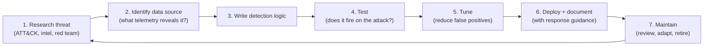

# Chapter 21 · Detection Engineering

> **Why this chapter matters:** Collecting logs (Chapter 20) is necessary but useless without *detections* — the logic that turns telemetry into "an attacker is here." Detection engineering is writing that logic well: accurate enough to catch real attacks, tuned enough not to drown analysts, and durable enough that attackers can't trivially evade it. It's the blue-team discipline where a CS graduate's coding and systems thinking shine brightest — it's essentially software engineering applied to catching adversaries, and it's a high-growth, well-paid specialization.

> **By the end of this chapter you will:** understand detection types and their trade-offs, write detections targeting attacker behavior (TTPs), use Sigma and YARA, tune to manage false positives, and apply "detection-as-code" practices.

---

## 21.1 What detection engineering is

A **detection** is logic that identifies malicious or suspicious activity in telemetry and raises an alert. **Detection engineering** is the systematic practice of designing, building, testing, tuning, and maintaining detections — treating them like software (versioned, tested, peer-reviewed), not one-off SIEM searches.

The goal is not "more alerts." It's **high-fidelity** alerts: catching real attacks (**true positives**) while minimizing **false positives** (noise) and **false negatives** (misses). Every detection is a balance among these, and managing that balance *is* the job.

---

## 21.2 The detection spectrum (and the Pyramid of Pain, applied)

Recall the **Pyramid of Pain** (Chapter 13): detecting cheap indicators (hashes, IPs) is easy for attackers to evade; detecting **behavior (TTPs)** forces them to re-tool. Detections span that spectrum:

| Detection type | Example | Evasion difficulty (for attacker) | Trade-off |
|---|---|---|---|
| **Atomic / IOC** | Alert on a known-bad hash or C2 IP | Trivial (change it) | Precise but brittle; near-zero false positives, high false negatives |
| **Signature** | A specific byte pattern (YARA), a known exploit string | Easy–moderate | Good for known threats; misses variants |
| **Behavioral / analytic** | "Word spawns PowerShell that spawns cmd" | Hard (must change how they operate) | Durable; more false positives; needs tuning |
| **Anomaly / statistical (UEBA)** | "This user logged in from a new country at 3am" | Varies | Finds unknowns; noisy; needs baselines |

**Mature programs weight toward behavioral detections** (the painful, durable layer) while still using cheap IOC detections for quick wins. A well-known example behavioral rule: *a Microsoft Office application spawning a scripting interpreter (PowerShell/cmd/wscript)* — normal users rarely do this, attackers constantly do (macro-based initial access, Chapter 2). That single behavior catches a whole class of attacks regardless of the specific malware.

---

## 21.3 The detection engineering lifecycle

Treat detections as an engineering process, not ad-hoc searches:



1. **Research the threat** — pick a technique to detect (ATT&CK ID, threat intel, or a gap from your coverage heatmap in Chapter 13). Understand *how* it actually works — which is why you learned the attacks in Part 3. **You can only detect what you understand.**
2. **Identify the data source** — what telemetry reveals it? (Chapter 20's table. Kerberoasting → 4769; LSASS dump → EDR process-access; reverse shell → outbound conn + odd process lineage.) MITRE ATT&CK lists data sources per technique — use it.
3. **Write the logic** — the query/rule (SPL/KQL/Sigma) that matches the behavior.
4. **Test** — actually run the attack (in your lab, or with an emulation tool) and confirm the detection fires. An untested detection is a hope, not a control.
5. **Tune** — run it against real/benign data and eliminate false positives (exclude known-good, add context, require multiple conditions). This is where most of the effort goes.
6. **Deploy + document** — ship it *with* an analyst playbook: what it means, how to triage, when to escalate (feeds Chapter 22).
7. **Maintain** — environments and attackers change; detections rot. Review, adapt, retire.

---

## 21.4 Sigma: portable detection-as-code

**Sigma** is a generic, vendor-neutral YAML format for writing detections that can be *converted* to any SIEM's query language (SPL, KQL, Elastic, etc.). It's the "write once, deploy anywhere" standard and the backbone of detection-as-code. A Sigma rule (simplified):

```yaml
title: Office Application Spawning PowerShell
status: experimental
description: Detects Office apps spawning PowerShell (common macro-based initial access)
logsource:
  category: process_creation
  product: windows
detection:
  selection:
    ParentImage|endswith:
      - '\winword.exe'
      - '\excel.exe'
      - '\outlook.exe'
    Image|endswith: '\powershell.exe'
  condition: selection
falsepositives:
  - Rare legitimate macros / admin tooling
level: high
tags:
  - attack.execution
  - attack.t1059.001
```

Note it's **mapped to ATT&CK** (`t1059.001`), documents **false positives**, and is human-readable and version-controllable. The huge open-source **SigmaHQ** rule repository is a goldmine: read real rules to learn how professionals express behavior as detection logic. Contributing a Sigma rule is an excellent, visible portfolio move.

---

## 21.5 YARA: pattern-matching for files and malware

**YARA** is the standard for writing rules that identify files (especially malware) by patterns — strings, byte sequences, structural traits. Used in malware analysis (Chapter 24), threat hunting, and EDR. A YARA rule:

```
rule Suspicious_PowerShell_Downloader {
  meta:
    description = "Flags PowerShell download-and-execute patterns"
  strings:
    $a = "DownloadString" nocase
    $b = "IEX" nocase
    $c = "FromBase64String" nocase
  condition:
    2 of them
}
```
YARA excels where you have files to scan (malware samples, email attachments, memory). It's a file-content detection (mid-pyramid) — powerful for known families, evadable by novel/obfuscated samples, which is why it complements behavioral detection rather than replacing it.

---

## 21.6 Tuning and the false-positive problem

The single hardest, most important part. A detection that fires 500 times a day — 499 benign — is worse than useless: analysts learn to ignore it, and the one real alert dies in the noise (**alert fatigue**, a documented cause of missed breaches). Tuning techniques:

- **Add context/conditions** — require the behavior *plus* something suspicious (e.g., Office→PowerShell *with* an encoded command or network connection), not the behavior alone.
- **Exclude known-good** — allowlist legitimate admin tools/accounts/paths that trigger it (carefully — attackers hide in allowlists).
- **Baseline first** — understand what's normal in *this* environment before deploying; the same rule's false-positive rate varies wildly by org.
- **Threshold/aggregation** — alert on volume/rate anomalies rather than single events (e.g., many 4769s, not one).
- **Risk scoring** — combine several weak signals into one higher-confidence alert (a modern approach; individual signals stay quiet, correlation raises the alarm).

The goal is a manageable stream of **actionable** alerts. Measuring detection quality (true/false positive rates, coverage, mean time to detect) turns this from art into engineering.

---

## 21.7 Validation: proving detections work

You must *test* detections against real attack behavior:
- **Atomic Red Team** — a free library of small, safe tests that execute individual ATT&CK techniques so you can confirm your detections fire. Run a test, check the alert. Essential.
- **Adversary emulation / purple teaming** (Chapters 13, 18) — red performs a technique, blue verifies detection, gaps become new rules. The best detections come from this loop.
- **Breach & Attack Simulation (BAS)** tools — automated, continuous validation.
- **Coverage mapping** — maintain your ATT&CK Navigator heatmap (Chapter 13); track what you can detect and close gaps by likely-adversary priority (**threat-informed defense**).

> **This is where your Part 3 knowledge becomes a defensive superpower.** Because you know *how* Kerberoasting, Pass-the-Hash, and reverse shells actually work, you can write detections that target their *essential behavior* (hard to evade) rather than superficial indicators (trivial to evade). Attackers who've only ever defended, and defenders who've never attacked, both write weaker detections. You won't.

---

## Common mistakes

- **Optimizing for "more alerts."** The goal is high-fidelity, actionable alerts. Volume without fidelity is harm.
- **Detecting only IOCs.** Bottom-of-pyramid; attackers evade instantly. Target behavior.
- **Never testing detections.** An untested rule is a guess. Use Atomic Red Team / purple teaming.
- **Deploying without tuning or a playbook.** Untuned rules cause fatigue; undocumented alerts stall triage.
- **"Set and forget."** Detections decay as environments and attackers change; maintain them.
- **Writing detections for attacks you don't understand.** You'll target the wrong (evadable) feature. Understand the mechanism first (Part 3).

---

## Labs

> **Lab 21.1 — Write your first behavioral detection.** In your SIEM (Chapter 20), write a rule for "Office application spawns PowerShell/cmd" using Sysmon/4688 data. Trigger it (open a doc that launches PowerShell in your lab). Confirm it fires. Document the logic and expected false positives.

> **Lab 21.2 — Detect a Part 3 attack for real.** Pick Kerberoasting (Ch 18), a reverse shell (Ch 17), or a brute force (Ch 12). Perform it in your lab, then write and tune a detection that catches it. Include: the ATT&CK ID, the data source, the query, test evidence, and false-positive handling. **This attack-and-detect writeup is the single best blue-team portfolio piece.**

> **Lab 21.3 — Read and adapt Sigma.** Browse the SigmaHQ repo. Pick three rules, understand each, and convert one to your SIEM's query language (use the `sigma`/`pySigma` converter). Then write your *own* Sigma rule for a technique you performed in Part 3, mapped to ATT&CK, with documented false positives.

> **Lab 21.4 — Validate with Atomic Red Team.** Install Atomic Red Team in your lab. Run a few atomic tests for techniques you've built detections for. Confirm your detections fire; where they don't, find out why and fix them. This closes the detection-engineering loop.

> **Lab 21.5 — Write a YARA rule.** Take a benign "suspicious-looking" script (or an EICAR test file) and write a YARA rule that matches its distinctive strings. Test it. Understand where YARA fits vs behavioral detection.

> **Lab 21.6 — Build and track coverage.** Update your ATT&CK Navigator heatmap (Chapter 13) with the detections you've built. Identify the biggest gap for a likely adversary and plan the next detection. This threat-informed prioritization is exactly what detection teams do.

---

## References and further reading

- **SigmaHQ** — [github.com/SigmaHQ/sigma](https://github.com/SigmaHQ/sigma) — the open detection rule repo and Sigma spec. Read real rules; contribute one.
- **Atomic Red Team (Red Canary)** — [github.com/redcanaryco/atomic-red-team](https://github.com/redcanaryco/atomic-red-team) — the standard for testing detections against ATT&CK techniques.
- **Florian Roth's / Red Canary's / SpecterOps' detection blogs** — practitioners publishing real detection engineering; some of the best free learning.
- **"Detection Engineering" resources & the "Detection Engineering Maturity Matrix"** — search these for the discipline's structure.
- **YARA documentation** — [yara.readthedocs.io](https://yara.readthedocs.io) — and the YARA rules repos for examples.
- **MITRE ATT&CK (data sources & detections per technique)** — your map of what to detect and with what telemetry.
- **The DFIR Report / Red Canary Threat Detection Report** — real intrusions and the detections that catch them.
- **Elastic / Splunk / Microsoft public detection rule repositories** — production-grade examples to study.

---

## Self-check

1. Why do mature detection programs favor behavioral detections over IOC-based ones? Tie it to the Pyramid of Pain.
2. Walk through the detection engineering lifecycle and explain why "test" and "tune" are non-negotiable.
3. What is Sigma and why is it valuable for detection-as-code?
4. A detection fires 500 times a day, almost all benign. Why is this actively harmful, and name three tuning techniques to fix it.
5. How does your offensive knowledge from Part 3 make you a better detection engineer?

<details>
<summary>Answers</summary>

1. Because IOC detections (hashes, IPs) sit at the bottom of the Pyramid of Pain — attackers change them trivially, so the detections are brittle (high false negatives). Behavioral detections target *how attackers operate* (TTPs) at the top of the pyramid, forcing them to re-engineer their whole approach to evade — making the detections durable and painful to bypass.
2. Research threat → identify data source → write logic → **test** → **tune** → deploy+document → maintain. **Test** is non-negotiable because an untested detection is just a hope — you must run the actual attack and confirm it fires. **Tune** is non-negotiable because an untuned rule generates false positives that cause alert fatigue, burying real detections; most of the engineering effort is reducing noise to actionable levels.
3. Sigma is a vendor-neutral YAML format for detections that converts to any SIEM's query language. It's valuable because it makes detections portable, human-readable, version-controllable, ATT&CK-mapped, and shareable (the SigmaHQ community repo) — enabling "write once, deploy anywhere" detection-as-code.
4. It's harmful because analysts learn to ignore the noisy alert (alert fatigue), so the rare real detection is missed — worse than not having it. Three fixes: **add context/conditions** (require the behavior plus something suspicious), **exclude known-good** (carefully allowlist legitimate triggers), **baseline/threshold** (alert on rate/volume anomalies or correlate multiple weak signals via risk scoring) rather than single events.
5. Because you understand *how* attacks actually work (their essential behavior vs superficial indicators), you can write detections that target the hard-to-change core of a technique (e.g., the ticket-request pattern of Kerberoasting, LSASS access for credential dumping) rather than evadable artifacts. You also know how attackers try to evade, so you build more robust, harder-to-bypass detections — a purple-team advantage.

</details>

---

## What's next

Your detections will fire on something real eventually. [Chapter 22](22-incident-response.md) is what you do then: incident response — the calm, structured process of containing, eradicating, and recovering from an attack, and learning from it. It's high-stakes work, and knowing the process cold is what keeps a bad day from becoming a catastrophe.
