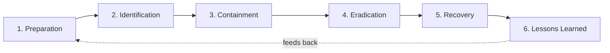

# Chapter 22 · Incident Response

> **Why this chapter matters:** Detection tells you something is wrong; incident response (IR) is what you *do* about it. When an attack is real, panic and improvisation cause more damage than the attacker. IR is the calm, structured process that contains the damage, removes the attacker, restores operations, and turns the event into lessons. "Assume breach" (Chapter 2) means every organization *will* have incidents — so IR competence is a core, always-in-demand skill, and the IR mindset (methodical under pressure) is what senior defenders are made of.

> **By the end of this chapter you will:** know the IR lifecycle cold, understand each phase's decisions and pitfalls, be able to build/read a playbook, and understand the human and organizational realities (communication, legal, evidence) that make real IR hard.

---

## 22.1 What counts as an incident

An **event** is any observable occurrence; an **alert** is an event flagged as potentially bad; an **incident** is a confirmed (or high-confidence) security breach — a violation of confidentiality, integrity, or availability (Chapter 2). Not every alert is an incident (that's what triage decides — Chapter 20/21); declaring an incident triggers a formal process, resources, and often legal/regulatory clocks. Knowing *when to declare* is itself a skill.

Severity classification (organizations define their own scale) drives the response: a single malware detection on one endpoint is not the same as ransomware spreading across the domain. Getting severity right prioritizes response and communication.

---

## 22.2 The IR lifecycle (know this cold)

The standard model (NIST SP 800-61) has six phases. Memorize them and their order — it's asked in every blue-team interview and it's the scaffolding for staying calm under fire.

**1. Preparation** — everything you do *before* an incident: the IR plan, playbooks, tooling (EDR, SIEM, forensic kit), trained people, defined roles, communication plans, contact lists, legal/PR relationships, backups tested for restore, and access to logs. *Most of IR success is decided here.* An org that prepared responds in minutes; one that didn't loses days figuring out who to call.

**2. Identification (Detection & Analysis)** — confirm an incident is real, determine scope and severity: what's affected, how the attacker got in, what they did, whether it's ongoing. This is where your Chapter 20–21 skills (querying, triage, correlation) and Chapter 23 forensics apply. Build an initial **timeline** and scope; resist the urge to act before you understand enough (but don't over-analyze while the house burns — judgment).

**3. Containment** — stop the bleeding without destroying evidence or tipping off the attacker prematurely. Short-term (isolate the host, block the C2 IP/domain, disable the compromised account) and long-term (rebuild segments, apply temporary controls). **Key tension:** isolate too fast and you may lose visibility into scope or alert the attacker to change tactics; too slow and damage spreads. Containment decisions are risk decisions (Chapter 10).

**4. Eradication** — remove the attacker and their footholds *completely*: malware, persistence mechanisms (Chapters 5–6), backdoors, compromised credentials (rotate them — remember the Golden Ticket lesson: some compromises require specific remediation like double-rotating krbtgt, Chapter 18). Half-eradication means the attacker returns. This requires having *fully scoped* the intrusion in phase 2 — you can't eradicate what you didn't find.

**5. Recovery** — restore systems to normal operations safely: rebuild from known-good (often better than cleaning), restore from *verified-clean* backups, validate systems are clean before reconnecting, monitor closely for the attacker's return. Balance speed (business pressure to restore) against certainty (don't restore a still-compromised system).

**6. Lessons Learned (Post-Incident)** — a blameless review: what happened, how we responded, what worked, what didn't, and concrete improvements (new detections — Chapter 21, closed gaps, updated playbooks). *This is where an organization actually gets more secure.* Skipping it wastes the incident's hardest lesson. The output feeds back into Preparation.

---

## 22.3 Playbooks

A **playbook** is a predefined, step-by-step response procedure for a specific incident type (phishing, ransomware, compromised account, data exfiltration, malware). Playbooks turn "panic and improvise" into "execute the plan," which is why prepared teams are calm. A phishing playbook, for example: confirm the report → identify all recipients → pull/quarantine the email → check who clicked/entered credentials → reset affected accounts → block sender/URLs → hunt for follow-on activity → document.

Good playbooks are specific, tested (tabletop exercises), and kept current. SOAR (Chapter 8/20) can automate parts of them. Reading and writing playbooks is a common junior-analyst task and a great portfolio artifact.

---

## 22.4 The realities that make IR hard

- **Pressure and stakes.** Systems down, money bleeding, executives demanding answers, possibly regulators and press. Calm methodicalness under this pressure is *the* IR skill.
- **Incomplete information.** You rarely know the full picture early. You must act on partial information while continuing to investigate — and update decisions as scope clarifies.
- **Communication.** Who needs to know what, when? Technical teams, management, legal, PR, customers, regulators — each needs different information at different times. Miscommunication causes as much damage as the breach. Many orgs use an **Incident Commander** role to coordinate.
- **Evidence preservation.** If the incident may lead to legal action or regulatory reporting, you must preserve evidence properly (chain of custody — Chapter 23) *while* containing. These goals can conflict; know the priority for the situation.
- **Legal and regulatory clocks.** Breaches involving personal data trigger notification deadlines (GDPR's 72-hour rule and others — Chapter 31). The clock often starts at *awareness*, not resolution — another reason identification and declaration matter.
- **The human factor.** Responders get tired and tunnel-visioned; blameless culture and rotation matter. And the *cause* is often human (phishing, misconfig), so response includes people, not just machines.

---

## 22.5 Ransomware: the incident everyone plans for now

Ransomware deserves special mention as the dominant real-world crisis (Chapter 2). Modern ransomware crews **exfiltrate data before encrypting** ("double extortion" — pay or we leak it), so it's a data breach *and* an availability crisis. Response hinges on: tested, *offline/immutable* backups (the single best defense), rapid isolation, the (fraught) pay/don't-pay decision (legal, ethical, and often ineffective — decryptors fail, and payment may violate sanctions), and prepared crisis communications. The preparation phase is where ransomware outcomes are decided.

> **The through-line:** IR is Chapter 10's risk management under time pressure. Every phase is a series of risk decisions made with incomplete information. Knowing the framework cold frees your cognition to make *those* decisions well.

---

## Common mistakes

- **No preparation.** Improvising the plan during the incident is the top cause of bad outcomes. Prepare before.
- **Acting before understanding scope.** Containing/eradicating a partially-understood intrusion lets the attacker persist elsewhere; you can't eradicate what you didn't find.
- **Destroying evidence while containing.** Pulling the plug can wipe volatile evidence (memory) and burn forensic/legal options. Know when to preserve first.
- **Incomplete eradication.** Missing one backdoor or unrotated credential invites the attacker straight back.
- **Skipping lessons learned, or making it a blame session.** Wastes the lesson and destroys the honesty needed to improve.
- **Poor communication.** Silence or wrong messaging to stakeholders/regulators compounds the crisis (and can be illegal).
- **No tested backups.** The difference between a bad day and a bankruptcy in a ransomware event.

---

## Labs

> **Lab 22.1 — Memorize and apply the lifecycle.** Write the six phases from memory. Then take an incident scenario (e.g., "EDR alerts on ransomware on three hosts") and write what you'd do in each phase, including the key decisions and their trade-offs.

> **Lab 22.2 — Write a playbook.** Create a complete phishing (or compromised-account) response playbook: triggers, roles, step-by-step actions, decision points, and communication steps. This is a real junior-analyst deliverable and a strong portfolio piece.

> **Lab 22.3 — Investigate a simulated incident.** Use a free platform: **LetsDefend**, **CyberDefenders**, or **Blue Team Labs Online** offer realistic IR/DFIR investigations (analyze the alert, scope it, respond). Complete one end to end and write up your investigation and timeline.

> **Lab 22.4 — Full attack-to-response in your lab.** Perform a multi-step attack from Kali (Chapters 17–18) against your monitored lab, then respond to it using the IR lifecycle: identify via SIEM, scope it, contain, eradicate, and write a post-incident report with a timeline and lessons learned. This integrates Parts 3–4 and is an exceptional portfolio project.

> **Lab 22.5 — Tabletop exercise.** Run a tabletop (discussion-based) exercise for a ransomware scenario, ideally with a friend playing "management." Walk through decisions: when to declare, whether to isolate, who to notify, the pay decision. IR is as much decision-making as tooling.

---

## References and further reading

- **NIST SP 800-61 (Computer Security Incident Handling Guide)** — the authoritative IR lifecycle. Read it; it's the source of the six-phase model.
- **SANS Incident Handler's Handbook & the SANS PICERL model** (Preparation, Identification, Containment, Eradication, Recovery, Lessons — the same lifecycle). Free, concise.
- **"Blue Team Handbook: Incident Response Edition" — Don Murdoch.** Practical field guide for responders.
- **LetsDefend, CyberDefenders, Blue Team Labs Online** — hands-on IR/DFIR simulations. The closest to real SOC/IR experience at home.
- **The DFIR Report** ([thedfirreport.com](https://thedfirreport.com)) — real intrusions from detection through response, with timelines. Read regularly.
- **CISA incident response resources & ransomware guides** — practical, current government guidance.
- **Your national CERT/CSIRT** — for reporting requirements and playbooks.
- **Verizon DBIR** (Chapter 2) — for how incidents actually unfold at scale.

---

## Self-check

1. List the six phases of the IR lifecycle in order, and state the decisive one and why.
2. Why can containing an incident *too fast* be a mistake?
3. Why must eradication depend on thorough identification/scoping?
4. What is a playbook and why do prepared teams stay calm during incidents?
5. Why does modern ransomware make tested, offline backups necessary but *not sufficient*?

Answers

1. **Preparation → Identification → Containment → Eradication → Recovery → Lessons Learned.** The decisive phase is **Preparation** — the plan, playbooks, tooling, trained people, communication, and tested backups established beforehand determine whether the org responds in minutes or flails for days; you can't build these mid-crisis.
2. Because acting before you've scoped the intrusion can tip off the attacker (who then changes tactics/hides deeper) and/or destroy volatile evidence, and you may isolate only part of the compromise while the attacker persists elsewhere. Containment is a risk decision balancing stopping damage against preserving visibility and evidence.
3. Because you can only remove footholds you've found. If identification missed a backdoor, an extra persistence mechanism, or a compromised credential, eradication is incomplete and the attacker returns — so full scoping in phase 2 is a precondition for successful eradication.
4. A playbook is a predefined, tested, step-by-step response procedure for a specific incident type (e.g., phishing, ransomware). Prepared teams stay calm because the decisions and steps are worked out in advance — they execute a plan instead of improvising under pressure, reducing errors and speeding response.
5. Modern ransomware uses **double extortion** — exfiltrating data before encrypting — so even flawless backups (which restore availability) don't prevent the **data breach** and leak threat. You still need exfiltration detection, breach notification/legal handling, and crisis communications; backups solve the encryption/availability half but not the confidentiality half.

---

## What's next

To respond well, you often need to reconstruct exactly what happened — from disk, memory, and artifacts. [Chapter 23](23-digital-forensics.md) is digital forensics: the rigorous, defensible practice of recovering and interpreting evidence. It powers the identification phase you just learned and stands alone as a specialization (DFIR).
