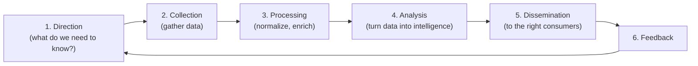
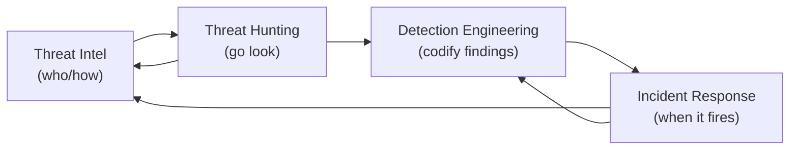

# Chapter 25 · Threat Intelligence and Threat Hunting

> **Why this chapter matters:** Detection (Chapter 21) waits for a rule to fire. But sophisticated attackers evade rules, and by the time an alert triggers, they may already be deep inside. **Threat intelligence** tells you *who* is likely to target you and *how* they operate; **threat hunting** proactively searches for the attackers your detections missed — assuming they're already in (Chapter 2's "assume breach"). This is the most advanced, proactive layer of defense, where all of Part 4 and your offensive knowledge from Part 3 fuse. It's also where the highest-level blue-team careers live.

> **By the end of this chapter you will:** understand the intelligence lifecycle and its levels, distinguish IOCs from TTPs in practice, run a hypothesis-driven hunt, and see how intel and hunting feed back into detection and response.

---

## 25.1 Threat intelligence: knowing your adversary

**Cyber Threat Intelligence (CTI)** is evidence-based knowledge about threats — actors, their motivations, capabilities, infrastructure, and TTPs — used to inform defensive decisions. Its purpose is to make defense **threat-informed** (Chapter 13): you defend against the adversaries who actually target organizations like yours, prioritizing accordingly, rather than defending everything equally against an abstract "hacker."

**The three levels of intelligence** (know who consumes each):
- **Strategic** — high-level, for executives/leadership: threat landscape, trends, geopolitical risk, which actor groups target your sector. Informs budget and strategy. (Non-technical.)
- **Operational** — for defense leads/hunters: specific campaigns, actor TTPs, what a group is doing now. Informs which detections and hunts to prioritize.
- **Tactical** — for analysts/tools: specific, machine-consumable indicators (IOCs — malicious IPs, domains, hashes) and detailed TTPs. Feeds SIEM/EDR/detection directly.

**IOCs vs TTPs (the crucial distinction, from Chapter 13's Pyramid of Pain):**
- **IOCs (Indicators of Compromise)** — atomic artifacts (hashes, IPs, domains). Easy to consume and block, but attackers change them trivially → short shelf life. Necessary but not sufficient.
- **TTPs (Tactics, Techniques, Procedures)** — *behavioral* intelligence about *how* an adversary operates. Durable, high-value, harder to act on — but forces the attacker to fundamentally change if you defend against them. Mature intel and hunting focus here.

The best intel programs move consumers *up* the pyramid — from "block these IPs" to "this actor uses these techniques; can we detect that behavior?"

---

## 25.2 The intelligence lifecycle

CTI is produced through a repeatable cycle:

The critical distinction: **data ≠ information ≠ intelligence.** A list of IPs is data. Contextualized ("these are the C2 servers of a group targeting your sector") it's information. Analyzed into an assessment that drives a decision ("therefore prioritize detecting their TTPs") it's intelligence. Producing genuine intelligence — not just relaying feeds — is the analyst's craft, and the **analysis** step (where human judgment adds value) is what distinguishes CTI from a threat feed.

**Sources:** open-source (OSINT — Chapter 14, vendor reports, blogs, social media), commercial feeds, **ISACs** (Information Sharing and Analysis Centers — sector-specific sharing communities), government (CISA, national CERTs), internal telemetry (your own incidents are your best, most relevant intel source), and the dark web. **Frameworks/standards:** MITRE ATT&CK (the lingua franca — Chapter 13), the Diamond Model (Chapter 13), STIX/TAXII (standardized formats for sharing intel), and **MISP** (open-source threat-intel sharing platform).

---

## 25.3 Threat hunting: assuming they're already in

**Threat hunting** is the proactive, hypothesis-driven search for attackers who have evaded automated detection. Its founding assumption is **"assume breach"** (Chapter 2): don't wait for an alert — go look, on the premise that a sophisticated adversary may already be present and quiet. Hunting finds the gaps your detections don't cover and generates *new* detections from what it finds.

**The hunt is hypothesis-driven** (not random log-staring). A hunt starts with a testable hypothesis, usually derived from threat intelligence or ATT&CK:

> *Hypothesis:* "An actor targeting our sector uses Kerberoasting (T1558.003, Chapter 18) for credential access. If they're in our environment, we'd see anomalous service-ticket request patterns. Let's look."

Then you **investigate the data** (Chapter 20 queries) to prove or disprove it:
1. **Form the hypothesis** (from intel/ATT&CK/anomalies/"what would I do as an attacker?" — your Part 3 knowledge is gold here).
2. **Identify the data** that would reveal it (Chapter 20's sources).
3. **Hunt** — query, pivot, correlate, look for the anomaly or the faint signal detections would miss.
4. **Resolve** — either you find evil (→ incident response, Chapter 22) or you don't (→ you've validated coverage or found a gap).
5. **Operationalize** — *every hunt, found evil or not, should produce output*: a new detection (Chapter 21), a tuning improvement, a coverage-map update (Chapter 13), or documented assurance. A hunt that ends with no artifact was half-wasted.

**Hunting models:**
- **Intel-driven** — hunt for a known actor's TTPs (as above).
- **Hypothesis-driven** — from your own reasoning about attacker behavior.
- **Anomaly/baseline-driven** — investigate statistical deviations from normal (needs UEBA/baselines — Chapter 20).
- **The "Crown Jewels" approach** — start from your most valuable assets and hunt for threats to them specifically.

> **This is where offense and defense fully fuse.** The best hunters think like attackers (Part 3): "If I wanted to move laterally to the DC undetected, how would I, and what faint trace would that leave?" Then they hunt for that trace. Your offensive knowledge makes you a *far* better hunter than someone who only ever defended — which is exactly why this booklet made you learn both.

---

## 25.4 The maturity picture: from reactive to proactive

The disciplines of Part 4 form a maturity progression:
1. **Reactive** — respond to alerts as they come (Chapters 20–22).
2. **Proactive detection** — engineer good detections mapped to threats (Chapter 21).
3. **Threat-informed** — prioritize by who actually targets you (this chapter's intel).
4. **Proactive hunting** — actively seek the undetected (this chapter).
5. **Adaptive** — feed everything back: hunts → detections → intel → better hunts, continuously improving (the loop below).

An organization operating this full loop is genuinely hard to breach *and* fast to catch what gets through — the practical meaning of "assume breach" done well. Being able to *describe this loop* and your place in it is a senior-level interview differentiator.

---

## Common mistakes

- **Confusing threat feeds with threat intelligence.** A feed of IOCs is data; intelligence is analyzed, contextualized, decision-driving. Don't just plug in feeds and call it a program.
- **Over-relying on IOCs.** Bottom of the pyramid; attackers change them instantly. Push toward TTP-level intel and hunting.
- **Random hunting.** Hunting without a hypothesis is just staring at logs. Start from intel/ATT&CK/reasoning.
- **Hunts with no output.** Every hunt should produce a detection, a tuning, a coverage update, or documented assurance — even when you find nothing.
- **Ignoring internal intel.** Your own past incidents are the most relevant intelligence you have.
- **Hunting without offensive understanding.** If you don't know how attacks work (Part 3), you don't know what to hunt for or what its faint trace looks like.

---

## Labs

> **Lab 25.1 — Consume real intelligence.** Read a current threat-actor report (from a vendor like Mandiant/CrowdStrike/Red Canary, or CISA advisories). Extract: the actor, their target sector, and their TTPs mapped to ATT&CK. Write a one-page "what this means for a defender" brief at the strategic and tactical levels.

> **Lab 25.2 — IOCs to TTPs.** From that report, list the IOCs *and* the TTPs. For each IOC, note how easily the attacker could change it (Pyramid of Pain). Then write a detection concept for one *TTP* — showing why behavioral detection outlasts IOC blocking.

> **Lab 25.3 — Run a hunt in your lab.** Form a hypothesis based on a Part 3 attack you know (e.g., "Pass-the-Hash lateral movement would show anomalous type-3 logons"). Perform the attack in your monitored lab, then hunt for it in your SIEM *as if you didn't know it happened*. Document the hypothesis, the queries, what you found, and the new detection you'd build. **Excellent portfolio piece.**

> **Lab 25.4 — Set up MISP (optional).** Stand up MISP (open-source threat-intel platform) in your lab, import some open feeds, and explore how IOCs and events are structured, shared, and correlated. Understand STIX/TAXII conceptually.

> **Lab 25.5 — Guided hunting.** Use free defensive platforms (CyberDefenders, Splunk BOTS from Chapter 20, or "Hunting" content on TryHackMe/LetsDefend) to practice hypothesis-driven investigation on realistic data. Write up each hunt.

---

## References and further reading

- **Katie Nickels & the SANS FOR578 material / "Cyber Threat Intelligence" resources** — Katie Nickels' talks and reading lists are the best free CTI starting point.
- **Scott Roberts & Rebekah Brown — *Intelligence-Driven Incident Response*.** Ties CTI and IR together; excellent and practical.
- **"The Threat Intelligence Handbook" (Recorded Future, free)** — a solid free primer on the CTI lifecycle and levels.
- **MITRE ATT&CK** (Chapter 13) and **the Diamond Model** — the analytic backbone of CTI.
- **MISP** ([misp-project.org](https://www.misp-project.org)) and **STIX/TAXII** ([oasis-open.github.io/cti-documentation](https://oasis-open.github.io/cti-documentation/)) — the sharing tools/standards.
- **The DFIR Report, Red Canary Threat Detection Report, Mandiant/CrowdStrike/Microsoft threat reports** — real, high-quality intel to practice consuming. Read continuously.
- **Threat hunting: "The ThreatHunting Project", Chris Sanders' *Practical Threat Intelligence and Data-Driven Threat Hunting* (Cordell/Roth), and the PEAK / TaHiTI hunting frameworks.**
- **Your national CERT/CISA advisories & sector ISAC** — the most relevant intel for a real defender.

---

## Self-check

1. Distinguish the three levels of threat intelligence and who consumes each.
2. What's the difference between data, information, and intelligence, and which step of the lifecycle creates the last one?
3. Why is threat hunting "hypothesis-driven," and where do good hypotheses come from?
4. Why should every hunt produce an output even when no attacker is found?
5. How does your Part 3 offensive knowledge make you a better threat hunter?

Answers

1. **Strategic** — high-level trends, threat landscape, and sector-targeting actors, consumed by executives/leadership to guide strategy and budget (non-technical). **Operational** — specific campaigns and actor TTPs, consumed by defense leads/hunters to prioritize detections and hunts. **Tactical** — specific, often machine-consumable IOCs and detailed TTPs, consumed by analysts/tools and fed directly into SIEM/EDR/detections.
2. **Data** is raw (e.g., a list of IPs); **information** is data with context (e.g., "these are a specific actor's C2 servers"); **intelligence** is analyzed information that drives a decision (e.g., "this actor targets us, so prioritize detecting their TTPs"). The **Analysis** step of the lifecycle — where human judgment adds context and assessment — creates intelligence.
3. Because random log-searching is inefficient and rarely finds sophisticated, quiet intruders; a testable hypothesis focuses the hunt on a specific attacker behavior and the data that would reveal it. Good hypotheses come from **threat intelligence** (a known actor's TTPs), **ATT&CK**, **anomalies/baselines**, and **thinking like an attacker** (your Part 3 knowledge — "how would I do this, and what trace would it leave?").
4. Because the goal is to continuously improve coverage, not just catch one intruder. Finding nothing still yields value: a **new detection** (codifying what you looked for), a **tuning improvement**, a **coverage-map update** (Chapter 13), or documented **assurance** that a technique would be caught. A hunt with no artifact wastes the effort and doesn't strengthen future defense.
5. Because hunting requires knowing *what to look for* and *what its faint signal looks like*. Having actually performed lateral movement, credential dumping, Kerberoasting, and privilege escalation (Part 3), you understand attackers' options, choices, and the subtle telemetry each leaves — so you form sharper hypotheses and recognize evasive, low-signal activity that a purely defensive analyst would miss.

---

## What's next

**Part 4 is complete.** You can see, detect, respond to, investigate, dissect, and proactively hunt threats — the full defensive arc, and the skills behind most security jobs. Now the booklet moves to where modern systems actually live. [Part 5 · Modern Platforms](../part-5-modern-platforms/26-cloud-security.md) covers cloud, containers, DevSecOps, and AI security — the fastest-growing, best-paid, and most in-demand areas of 2026, and the ones where your CS background gives you the strongest edge. Chapter 26 begins with cloud.
