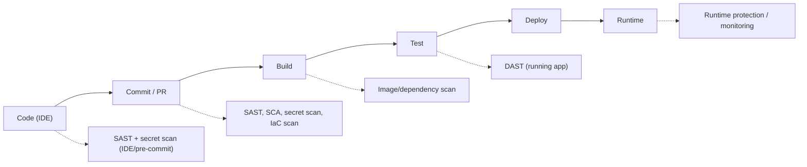

# Chapter 28 · DevSecOps and Software Supply Chain

> **Why this chapter matters:** This is the purest expression of the **security engineering path** — and where your CS degree pays the highest dividend. Modern software ships continuously through automated pipelines, and security can't be a manual gate at the end without becoming a bottleneck everyone routes around. DevSecOps builds security *into* how software is made — automated, early, and developer-friendly. And the **software supply chain** (all the code, dependencies, and build infrastructure you *didn't* write but depend on) has become a top-tier attack vector: compromise one widely-used component and you compromise everyone who uses it. If you can code, this is arguably your highest-leverage specialization.

> **By the end of this chapter you will:** understand the DevSecOps philosophy and pipeline, the security testing types (SAST/DAST/SCA/secrets/IaC scanning), software supply-chain risks and defenses (SBOM, signing, SLSA), and how to make the secure path the easy path.

---

## 28.1 The DevSecOps philosophy: shift left, automate, empower

**DevSecOps** integrates security into DevOps — into the continuous development and deployment pipeline — rather than bolting it on at the end. Three core ideas:

- **Shift left** — move security *earlier* in the software lifecycle. A vulnerability caught in the developer's IDE or pull request costs minutes to fix; the same bug found in production after a breach costs orders of magnitude more (money, reputation, incident response). Earlier = cheaper = safer. This is the economic heart of DevSecOps.
- **Automate** — security checks run automatically in the pipeline (on every commit/PR/build), not as manual reviews that don't scale. Humans can't review 200 developers' changes; automation can.
- **Empower developers, don't gate them** — the goal is to make the **secure path the easy path** (recall *psychological acceptability*, Chapter 10). Give developers fast, actionable feedback and secure defaults so security is something they *do*, not something *done to them*. Security that blocks and blames gets bypassed; security that helps gets adopted.

The mindset shift: security's job becomes *building guardrails and tooling* so that 200 developers can each ship secure code without each being a security expert — a force multiplier, and exactly the kind of systems problem a CS graduate is trained to solve.

---

## 28.2 The secure pipeline (CI/CD security testing)

A modern CI/CD pipeline runs automated security checks at each stage. Know each testing type — what it does, its strengths, and its blind spots:

- **SAST (Static Application Security Testing)** — analyzes *source code* for vulnerabilities without running it (e.g., SQL built by string concatenation — Chapter 16). Runs early (IDE, PR). Strength: early, finds code-level bugs, sees all code paths. Weakness: **false positives**, can't find runtime/config/logic issues. Tools: Semgrep (free, excellent), CodeQL, SonarQube, Snyk Code.
- **DAST (Dynamic Application Security Testing)** — tests the *running application* from the outside, like an automated attacker (Chapter 16). Strength: finds real, exploitable runtime issues, no false-positive-heavy source analysis. Weakness: needs a running app, limited coverage (only what it can reach), later in the pipeline. Tools: OWASP ZAP (free), Burp (Chapter 16), Nuclei.
- **SCA (Software Composition Analysis)** — scans your **dependencies** for known-vulnerable components (the supply-chain problem below). Since most of a modern app is third-party code, this is critical. Tools: Dependabot, Snyk, Trivy, OWASP Dependency-Check.
- **Secret scanning** — detects hardcoded credentials/keys/tokens in code and Git history (Chapters 11, 26). Tools: gitleaks, TruffleHog, GitHub secret scanning. ⚠️ Secrets in Git persist in *history* even after removal — they must be rotated, not just deleted.
- **IaC scanning** — checks infrastructure-as-code (Terraform, K8s manifests, CloudFormation) for misconfigurations *before* deployment (Chapters 26–27). Tools: Checkov, tfsec, KICS.
- **Container/image scanning** — Chapter 27 (Trivy, Grype).
- **Runtime protection/monitoring** — feeds Part 4 (detection).

No single test is sufficient — they're complementary (SAST sees code, DAST sees behavior, SCA sees dependencies). Layering them across the pipeline is **defense in depth** (Chapter 10) applied to the SDLC. And all of them must be **tuned** (Chapter 21's false-positive lesson): a scanner that floods developers with false positives gets disabled, so triaging and tuning findings is core DevSecOps work.

---

## 28.3 The software supply chain: your biggest blind spot

You write maybe 10% of the code you ship; the other 90% is **dependencies, base images, build tools, and CI/CD infrastructure** you didn't write. The **software supply chain** is all of it — and it's a top attack vector because compromising one popular component compromises everyone downstream (huge leverage for attackers). Landmark incidents (SolarWinds — a compromised build pipeline poisoned thousands of customers; Log4Shell — a ubiquitous library's vulnerability; malicious/typosquatted packages in npm/PyPI) made this a board-level concern.

**The categories of supply-chain risk:**
- **Vulnerable dependencies** — a library with a known CVE (Log4Shell). Addressed by SCA + patching.
- **Malicious dependencies** — a package that is *deliberately* malicious: **typosquatting** (`reqeusts` vs `requests`), **dependency confusion** (tricking the build into pulling an attacker's package from a public registry instead of your internal one), account-takeover of a legit maintainer, or a maintainer inserting a backdoor.
- **Compromised build/CI-CD infrastructure** — attackers poison the *build process* itself (SolarWinds), so even reviewed source produces a trojaned artifact. Your pipeline is production infrastructure and a high-value target.
- **Compromised update mechanisms** — poisoned software updates delivered to users.

**The defenses (an emerging, in-demand discipline):**
- **SBOM (Software Bill of Materials)** — a complete inventory of every component in your software. You can't secure or respond to what you don't know you have; when the next Log4Shell drops, an SBOM tells you in minutes whether you're affected. Increasingly *required* (including by governments).
- **Dependency management** — pin versions, use lockfiles, vet new dependencies, prefer fewer/reputable ones, use private registries and scoping to prevent dependency confusion.
- **Artifact signing & verification** — sign build artifacts and container images (**Sigstore/cosign**) so consumers verify integrity and provenance (Chapters 11, 27).
- **Provenance & SLSA** — **SLSA** (Supply-chain Levels for Software Artifacts) is a framework for build integrity: proving *how* an artifact was built and that the pipeline wasn't tampered with. Know the term.
- **Secure the pipeline** — least-privilege CI/CD, protect signing keys, review pipeline configs, isolate build environments, require signed commits.
- **Policy as code / guardrails** — automated policies that *enforce* the above (block unsigned images, fail builds with critical CVEs, reject hardcoded secrets).

---

## 28.4 Making it work: culture and guardrails

The hardest part of DevSecOps is organizational, not technical:
- **Security champions** — embed security-minded developers in each team to scale security culture beyond the security team.
- **Guardrails over gates** — automated, secure-by-default templates and paved roads that make the secure choice the default and the easy one. (A vetted "golden" base image, a secure project template, a pre-approved Terraform module.)
- **Fast, actionable feedback** — findings in the PR, in the developer's language, with the fix — not a 200-page report weeks later (Chapter 19's remediation lesson, applied continuously).
- **Metrics** — mean time to remediate, % of builds passing security gates, dependency freshness — to manage the program (Chapter 30).

> **Why this is *your* lane as a CS graduate:** DevSecOps is *software engineering applied to security*. You build the scanners into pipelines, write the policy-as-code, create the secure templates, automate the guardrails, and triage/tune the findings. Every skill from Part 1 (scripting, Git, CI/CD, Docker) and the vulnerability knowledge from Parts 3–4 converges here. It's high-demand, well-paid, and the roles explicitly want people who can *code*, not just audit. If the offensive/defensive split hasn't grabbed you, this is very likely your home.

---

## Common mistakes

- **Security as a final gate.** Bolting it on at the end creates a bottleneck developers bypass. Shift left and automate.
- **Deploying scanners without tuning.** Floods of false positives get the tools disabled. Triage and tune (Chapter 21).
- **Gating and blaming instead of enabling.** Security that fights developers loses. Build guardrails and paved roads.
- **Ignoring the supply chain.** Your dependencies and pipeline are most of your attack surface and a top real-world vector.
- **Deleting a leaked secret without rotating it.** It persists in Git history; assume it's compromised and rotate.
- **No SBOM.** When the next critical dependency CVE drops, you'll be scrambling to find out if you're affected. Inventory now.
- **Treating one scanner type as enough.** SAST/DAST/SCA/secrets/IaC are complementary; you need the layers.

---

## Labs

> **Lab 28.1 — Build a secure pipeline.** Take a small app in a Git repo (GitHub/GitLab). Add a CI pipeline (GitHub Actions) that runs on every PR: **Semgrep** (SAST), **gitleaks** (secrets), and **Trivy**/**Dependabot** (SCA/dependencies). Introduce a vulnerability and a hardcoded secret, and watch the pipeline catch them. **A superb portfolio project** — it demonstrates the whole DevSecOps skill set.

> **Lab 28.2 — Find and fix a vulnerable dependency.** In a project, add a dependency with a known CVE, detect it with SCA, and remediate (upgrade). Then generate an **SBOM** (with Syft or Trivy) and inspect it. Write up how an SBOM would help during the next Log4Shell.

> **Lab 28.3 — Secret leak simulation.** Commit a fake API key, then use **TruffleHog**/**gitleaks** to find it — including in Git *history* after you "remove" it. Demonstrate why rotation (not deletion) is the fix. Document the incident as you would for a real one.

> **Lab 28.4 — IaC scanning.** Write insecure Terraform (public bucket, open security group — Chapter 26), scan with **Checkov**/**tfsec**, and fix the findings. Integrate the scan into your pipeline so insecure infra can't merge.

> **Lab 28.5 — Sign and verify.** Build a container image, sign it with **cosign** (Sigstore), and verify the signature. Understand how signing establishes artifact provenance and integrity against supply-chain tampering.

> **Lab 28.6 — Policy as code.** Write a simple policy (OPA/Conftest, or a pipeline rule) that fails the build if a critical-severity vulnerability or a hardcoded secret is present. You've just turned a security requirement into an automated, unbypassable guardrail.

---

## References and further reading

- **OWASP DevSecOps Guideline & OWASP SAMM** — practical frameworks for building security into the SDLC.
- **"Securing DevOps" — Julien Vehent** and **"DevOpsSec" (O'Reilly)** — solid books on the philosophy and practice.
- **SLSA framework** ([slsa.dev](https://slsa.dev)) and **CNCF Software Supply Chain Security papers** — the supply-chain integrity standards. Know SLSA.
- **Sigstore / cosign** ([sigstore.dev](https://www.sigstore.dev)) — artifact/image signing.
- **Semgrep, OWASP ZAP, Trivy, gitleaks/TruffleHog, Checkov, Syft (SBOM), Dependabot** — the free tool stack. Learn Semgrep and Trivy first.
- **NIST SSDF (Secure Software Development Framework, SP 800-218)** — the authoritative secure-SDLC practices, increasingly referenced by regulation.
- **The SolarWinds and Log4Shell post-mortems** — read these to understand why supply chain became a top priority.
- **GitHub/GitLab security documentation** — how to wire these checks into real pipelines.

---

## Self-check

1. What does "shift left" mean and what's the economic argument for it?
2. Distinguish SAST, DAST, and SCA — what each finds and each one's blind spot — and why you need all three.
3. What is the software supply chain, and give three distinct categories of supply-chain attack.
4. What is an SBOM and why does it matter when a critical dependency vulnerability is disclosed?
5. Why is "make the secure path the easy path" the central cultural principle of DevSecOps, and which Chapter 10 design principle does it invoke?

Answers

1. Shifting left means moving security checks *earlier* in the software lifecycle (into the IDE, commit, and PR) rather than at the end. The economic argument: a vulnerability caught early costs minutes to fix, while the same bug found in production (or via a breach) costs orders of magnitude more in remediation, incident response, and reputation — so earlier is cheaper and safer.
2. **SAST** analyzes source code statically — finds code-level bugs early but produces false positives and misses runtime/config issues. **DAST** tests the running app from outside — finds real exploitable runtime issues but needs a running app and has limited reach. **SCA** scans dependencies for known CVEs — critical because most code is third-party but doesn't cover your own logic. They're complementary (code vs behavior vs dependencies), so layering them gives defense-in-depth coverage no single tool provides.
3. The software supply chain is everything you depend on but didn't write — dependencies, base images, build tools, and CI/CD infrastructure. Three attack categories: **vulnerable dependencies** (a library with a known CVE, e.g., Log4Shell); **malicious dependencies** (typosquatting, dependency confusion, or a backdoored/hijacked package); and **compromised build/CI-CD infrastructure** (poisoning the build itself so even clean source yields a trojaned artifact, e.g., SolarWinds).
4. An SBOM is a complete inventory of every component in your software. When a critical dependency CVE drops, it lets you determine in minutes whether — and where — you're affected, instead of manually hunting across all projects. You can't secure or respond to components you don't know you have, which is why SBOMs are increasingly required.
5. Because 200 developers won't each become security experts, and security that blocks or blames them gets bypassed; if the secure option is the default and easiest choice (paved roads, secure templates, fast actionable feedback), developers adopt it naturally, scaling security across the org. It invokes **psychological acceptability** — security must be usable or people route around it.

---

## What's next

You can build security into how software is made. The final modern-platform chapter tackles the technology reshaping both attack and defense — and the single most in-demand, least-saturated skill of 2026. [Chapter 29](29-ai-and-llm-security.md) is AI and LLM security: how to secure and attack AI systems, your biggest differentiator in the job market.
