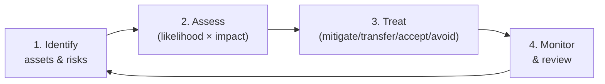

# Chapter 30 · GRC: Frameworks and Risk Management

> **Why this chapter matters:** Technical people often dismiss GRC (Governance, Risk, and Compliance) as "paperwork." That's a mistake that will cap your career. GRC is *how security gets funded, measured, prioritized, and justified to the business*. It's the language executives and boards speak, the reason your technical controls exist, and — for many people — a genuine entry point into the field (GRC roles hire beginners readily). Even if you never work in GRC, understanding it makes you far more effective: you'll know *why* you're doing what you're doing, and you'll be able to argue for resources. This chapter demystifies the frameworks and the risk management that run every security program.

> **By the end of this chapter you will:** understand governance, the major frameworks (NIST CSF, ISO 27001, CIS Controls, SOC 2, etc.), the risk management process, controls and their types, audits, and how security connects to business objectives.

---

## 30.1 Why GRC exists: security serves the business

A company doesn't exist to be secure; it exists to do business, and security *enables* that business by managing risk to an acceptable level. Every security control costs money, time, and friction — so security must be **justified, prioritized, and measured** like any other business function. GRC is the discipline that does this:

- **Governance** — who's accountable, what the policies are, how decisions get made, how security aligns with business goals. The "who decides and who's responsible" layer.
- **Risk management** — identifying, assessing, and treating risk systematically (Chapter 10's Risk = Likelihood × Impact, operationalized across the whole organization).
- **Compliance** — meeting external requirements (laws, regulations, contracts, standards).

The through-line: **security decisions are risk decisions, and risk decisions are business decisions.** A CISO who says "we need this because it's best practice" loses; one who says "this reduces our expected annual loss from X to Y for a cost of Z, addressing our top risk" wins. Learning to think and speak this way is a career accelerator at every level.

---

## 30.2 Governance: policies, standards, procedures

Governance sets the rules. Know the hierarchy (a common exam and interview point — they're not interchangeable):

- **Policy** — high-level management intent and requirements ("all data must be encrypted at rest"). *What and why*, mandatory, rarely changes.
- **Standard** — specific mandatory requirements supporting a policy ("use AES-256 for encryption at rest"). *What specifically.*
- **Procedure** — step-by-step instructions ("here's how to enable encryption on this system"). *How.*
- **Guideline** — recommended, non-mandatory best practice. *Suggestions.*
- **Baseline** — a minimum required configuration for a system type.

Governance also defines **roles and accountability** (who owns which risk), **security awareness** (training people — since humans are a top attack vector, Chapter 14), and how security aligns with business strategy. A security program without governance is a pile of tools with no direction.

---

## 30.3 The major frameworks (know what each is for)

Frameworks are structured, reusable approaches to security. You don't memorize them cover-to-cover, but you must know what each *is*, *who uses it*, and *when it applies* — this vocabulary is expected in interviews and daily work.

| Framework | Type | What it is / when used |
|---|---|---|
| **NIST Cybersecurity Framework (CSF 2.0)** | Voluntary framework | The most widely used *organizing* framework. Six functions: **Govern, Identify, Protect, Detect, Respond, Recover.** A flexible way to structure and assess a whole program. Start here. |
| **NIST SP 800-53** | Control catalog | A massive, detailed catalog of security controls; mandatory for US federal systems, widely referenced elsewhere. |
| **NIST SP 800-171 / CMMC** | Requirements | Protecting controlled unclassified info; US defense supply chain. |
| **ISO/IEC 27001** | Certifiable standard | The international standard for an **ISMS** (Information Security Management System). Organizations get *certified* against it — common globally and in contracts. 27002 gives the control guidance. |
| **CIS Controls v8** | Prioritized controls | 18 prioritized, practical, prescriptive controls ("do these, in this order"). **The best starting point for actually implementing security.** Highly actionable for practitioners. |
| **CIS Benchmarks** | Config baselines | Specific secure-configuration guides per technology (Chapters 26–27 referenced these). |
| **SOC 2** | Attestation report | A report (by an auditor) on a service org's controls across Trust Services Criteria (security, availability, confidentiality, etc.). Ubiquitous in SaaS B2B sales — customers demand it. |
| **PCI-DSS** | Mandatory standard | Required for anyone handling payment card data. Prescriptive and enforced. |
| **HIPAA** | Regulation | US healthcare data protection (Chapter 31). |

**How they relate:** NIST CSF *organizes* (the map); CIS Controls and 800-53 provide the *controls* (the actions); ISO 27001 provides a *certifiable management system*; SOC 2/PCI/HIPAA are *compliance obligations* you meet using the others. Many orgs map multiple frameworks to a common control set to avoid duplicating work.

> **Compliance ≠ security.** This is the most important GRC lesson for a technical person. You can be fully compliant and still get breached (compliance is a minimum bar, often lagging real threats), and you can be genuinely secure while failing a checkbox. Compliance is *necessary* (legal/contractual) but *not sufficient*. Treat it as a floor to build on, never the goal. Cynically "checkbox complying" without real security is how compliant companies end up in the breach headlines.

---

## 30.4 The risk management process

This is GRC's engine — Chapter 10's risk thinking, run as an organizational process (formalized in **NIST SP 800-37 (Risk Management Framework)** and **ISO 27005**):

1. **Identify** — catalog assets (what has value — data, systems, reputation) and the risks to them (threats × vulnerabilities — Chapter 10). Output: a **risk register**.
2. **Assess** — for each risk, estimate **likelihood × impact**.
   - **Qualitative** — High/Medium/Low ratings, risk matrices. Fast, subjective, common.
   - **Quantitative** — money terms: **SLE** (Single Loss Expectancy) × **ARO** (Annual Rate of Occurrence) = **ALE** (Annualized Loss Expectancy). E.g., a breach costing $500K (SLE) expected once every 5 years (ARO 0.2) = $100K ALE. This lets you compare a control's cost to the risk it reduces. Know these acronyms.
3. **Treat** — choose a response (Chapter 10): **mitigate** (add controls), **transfer** (insurance, outsourcing), **accept** (tolerate it, documented, signed off by the risk owner), or **avoid** (stop the activity). **Risk acceptance is a legitimate, formal decision** made by the business owner — not something a technician decides unilaterally, and it must be documented.
4. **Monitor** — risk is continuous; reassess as threats, assets, and controls change. The **residual risk** (what remains after treatment) is tracked and owned.

The **risk register** — a living document listing each risk, its owner, assessment, treatment, and status — is the central artifact of risk management and a common GRC-analyst deliverable.

---

## 30.5 Controls: the vocabulary

A **control** is a safeguard that reduces risk. You'll classify controls two ways (interview staple):

**By function:**
- **Preventive** — stop it happening (firewall, MFA, encryption).
- **Detective** — spot it happening (SIEM, IDS, logging — Part 4).
- **Corrective** — fix/recover after (backups, incident response, patching).
- (Also: **deterrent** — discourage; **compensating** — an alternative when the primary control isn't feasible; **directive** — policies/instructions.)

**By type:**
- **Administrative** — policies, procedures, training (the human/process layer).
- **Technical (logical)** — technology controls (the tools you've learned in Parts 3–5).
- **Physical** — locks, cameras, guards, badge access.

**Defense in depth** (Chapter 10) means layering controls across all these categories so no single failure is catastrophic. GRC ensures the *right* controls exist for the *actual* risks — and that you're not spending on low-risk areas while high-risk ones go uncovered.

---

## 30.6 Audits, assessments, and metrics

- **Audit** — a formal, often independent evaluation of whether controls exist and work as intended (for compliance/certification like ISO 27001, SOC 2). Auditors check *evidence*; "we do it" isn't enough without proof (logs, tickets, configs). This is why documentation and logging (Part 4) matter beyond detection.
- **Assessment** — a broader evaluation of security posture (may include the pentest of Chapter 19, a risk assessment, a gap analysis against a framework).
- **Third-party / vendor risk management** — assessing the security of vendors and suppliers you depend on (your risk includes *their* risk — supply chain, Chapter 28). Security questionnaires, SOC 2 review, contractual requirements. A growing, important area.
- **Metrics & KPIs/KRIs** — you manage what you measure: mean time to detect/respond (Part 4), patch compliance, % of systems meeting baseline, risk-register trends, control coverage (mapped to ATT&CK, Chapter 13). Metrics translate security into the language executives fund.
- **Business Continuity (BCP) & Disaster Recovery (DR)** — planning to keep the business running and recover from disruption (Chapter 22's recovery, at organizational scale). Key metrics: **RTO** (Recovery Time Objective — how fast you must recover) and **RPO** (Recovery Point Objective — how much data loss is tolerable). Know these.

> **Why a technical practitioner should care:** GRC is where your technical work gets *prioritized and funded*. When you understand risk registers, frameworks, and how to express security in business/financial terms, you can (a) argue successfully for the tools and time you need, (b) prioritize your own work by real risk, and (c) advance — senior and leadership roles are fundamentally GRC-literate. The best technical security people speak both languages.

---

## Common mistakes

- **Dismissing GRC as "just paperwork."** It's how security gets funded and prioritized; ignoring it caps your career and leaves you unable to argue for resources.
- **Confusing compliance with security.** Compliance is a minimum floor, often lagging threats — necessary but never sufficient. Don't checkbox and call it secure.
- **Treating risk acceptance as failure.** It's a legitimate, documented business decision made by the risk owner — not every risk should be mitigated.
- **Mixing up policy/standard/procedure.** Know the hierarchy; it's basic GRC literacy.
- **Only speaking "tech."** Learn to express security as risk in business/financial terms (ALE, risk reduction). It's how you get heard.
- **Forgetting evidence.** Auditors (and good practice) need proof controls work — documentation and logging, not assertions.

---

## Labs

> **Lab 30.1 — Build a risk register.** For a fictional (or your own) small company, identify five key assets and their top risks. For each: assess likelihood × impact (qualitative), assign an owner, and choose a treatment. Present it as a proper risk register table. This is a real GRC-analyst deliverable and a strong portfolio piece for the GRC path.

> **Lab 30.2 — Framework mapping.** Take the NIST CSF 2.0 six functions (Govern/Identify/Protect/Detect/Respond/Recover) and map skills/controls you've learned in this booklet to each function. This shows you how the whole field fits one organizing framework — and it's genuinely clarifying.

> **Lab 30.3 — Quantitative risk.** Pick a risk (e.g., ransomware). Estimate SLE, ARO, and compute ALE. Then propose a control, estimate its cost, and argue whether it's worth it (does risk reduction exceed cost?). Practice the financial-justification skill executives respond to.

> **Lab 30.4 — CIS Controls self-assessment.** Take the CIS Controls v8 (free) and assess your home lab (or a fictional org) against the first few Implementation Group 1 controls. Identify gaps and prioritize remediation. This mirrors real practitioner work.

> **Lab 30.5 — Write a policy.** Write a one-page acceptable-use or data-classification policy, then the supporting standard and a procedure. Get the hierarchy right. A common early-career GRC task.

---

## References and further reading

- **NIST Cybersecurity Framework 2.0** — [nist.gov/cyberframework](https://www.nist.gov/cyberframework). Read the framework; it's the master organizing map. Free.
- **CIS Controls v8** — [cisecurity.org/controls](https://www.cisecurity.org/controls) — the most actionable, prioritized controls list. Free; the best practitioner starting point.
- **ISO/IEC 27001/27002** — the certifiable ISMS standard (paid, but summaries abound).
- **NIST SP 800-37 (RMF), 800-53 (controls), 800-30 (risk assessment)** — the authoritative US risk/control documents. Free.
- **"The Cybersecurity Manager's Guide" — Todd Barnum** and **"CISSP Official Study Guide" (Sybil/Chapple)** — the CISSP material is an excellent GRC/management education even if you don't sit the exam.
- **FAIR (Factor Analysis of Information Risk)** — a leading quantitative risk model; the FAIR Institute has free material. Increasingly in demand.
- **SANS GRC/security-management resources** and **the "Open Policy" templates (SANS security policy templates, free)** — real policy examples.
- **AICPA SOC 2 & PCI-DSS official docs** — for those specific compliance regimes.

---

## Self-check

1. Why is "compliance ≠ security" the most important GRC lesson, and give an example of each direction of the mismatch.
2. Distinguish policy, standard, and procedure.
3. Walk through the risk management process and explain what a risk register captures.
4. Compute and interpret ALE from a scenario, and explain how it justifies (or doesn't) a control.
5. What does NIST CSF 2.0 provide that CIS Controls doesn't, and vice versa?

Answers

1. Because compliance is a minimum, often-lagging checklist of external requirements, while security is actually managing real risk — so they can diverge. You can be **compliant but breached** (met every checkbox yet missed a real threat the standard didn't cover) and **secure but non-compliant** (genuinely well-defended yet failing a specific mandated control). Compliance is necessary (legal/contractual) but not sufficient; treat it as a floor, not the goal.
2. **Policy** = high-level mandatory management intent/requirement (what and why, e.g., "data must be encrypted at rest"). **Standard** = specific mandatory requirement supporting the policy (what specifically, e.g., "use AES-256"). **Procedure** = step-by-step how-to instructions to implement it. Policy→standard→procedure moves from intent to specifics to steps.
3. Identify assets and risks → assess each by likelihood × impact (qualitative or quantitative) → treat (mitigate/transfer/accept/avoid) → monitor and reassess continuously. The **risk register** captures each risk with its owner, assessment (likelihood/impact), chosen treatment, residual risk, and status — the living central artifact of risk management.
4. Example: a data breach costs $500K per occurrence (SLE) and is expected once every 5 years (ARO = 0.2), so ALE = SLE × ARO = **$100K/year**. A control costing $30K/year that substantially reduces that risk is justified (cost < expected annual loss reduced); a control costing $200K/year for the same risk generally isn't. ALE lets you compare control cost to risk reduction in dollars.
5. **NIST CSF 2.0** provides a flexible high-level *organizing framework* (six functions: Govern/Identify/Protect/Detect/Respond/Recover) to structure and assess a whole program — but it's not prescriptive about *how*. **CIS Controls** provides a prescriptive, prioritized list of specific *actions to implement* ("do these, in this order") — but isn't a full program-governance framework. You use CSF to organize/assess and CIS to implement; they're complementary.

---

## What's next

GRC handles internal risk and voluntary frameworks. But some requirements aren't optional — they're the law. [Chapter 31](31-privacy-regulation-and-data-protection.md) covers privacy, data protection, and the regulations (GDPR and others) that legally bind you and your employer, with real consequences for getting them wrong.
